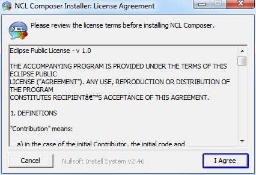
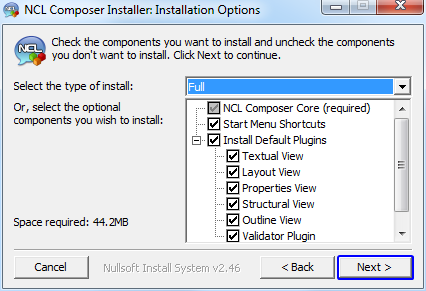
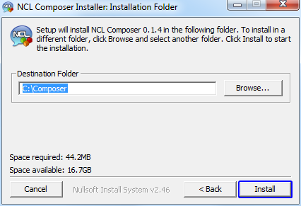
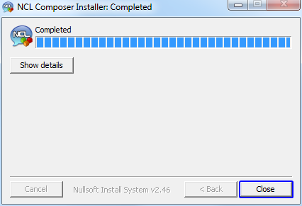

# Instalando o {nclcomposer}
## Windows

Para instalar o {nclcomposer} em ambiente Windows:

  * Baixe a versão mais atual do {nclcomposer} para Windows em:
    [http://composer.telemidia.puc-rio.br/en/download](http://composer.telemidia.puc-rio.br/en/download)

  * O arquivo deve ter o nome na forma _nclcomposer-installer-X.X.X.exe_, onde
    _X.X.X_ deve conter a versão do {nclcomposer}. Execute esse arquivo.

  * Caso você tenha alguma versão anterior instalada, o instalador irá
    perguntar se deseja desinstalá-la antes de prosseguir.

  * Caso contrário, a seguinte tela será exibida:

  * Clique no botão _I Agree_ para aceitar a licença do {nclcomposer}.
  * Após aceitar a licença do software, será possível escolher quais _plugins_
    serão instalados na sua máquina, por meio da tela (em caso de dúvida não
    altere):

  * Clique no botão _Next_, e será possível escolher o local onde o
	{nclcomposer} será instalado:

  * Por fim, o {nclcomposer} será instalado, e a seguinte tela exibida:
  

  * Caso não tenha ocorrido nenhum problema, feche o instalador. Será possível 
    executar o {nclcomposer} através do menu _Iniciar->TeleMídia->NCL 
    Composer_.

## Linux (Ubuntu/Debian)

Para instalar o {nclcomposer} em ambiente Linux (Ubuntu/Debian):

  * Baixe a versão mais atual do {nclcomposer} para Linux (Ubuntu/Debian) em:
    [http://composer.telemidia.puc-rio.br/en/download](http://composer.telemidia.puc-rio.br/en/download)
  * O arquivo deve ter o nome na forma _nclcomposer_X.X.X_i386.deb_, onde
    X.X.X deve conter a versão do {nclcomposer}. Para instalar o arquivo que foi
    baixado, execute o seguinte comando na linha de comando:

    > $ dpkg -i nclcomposer-X.X.X.deb

  * Caso a instalação ocorra sem problemas, é possível acessar o
    {nclcomposer} através do menu de aplicações, ou por meio do comando:

	> $ nclcomposer

## MacOS X

TODO

