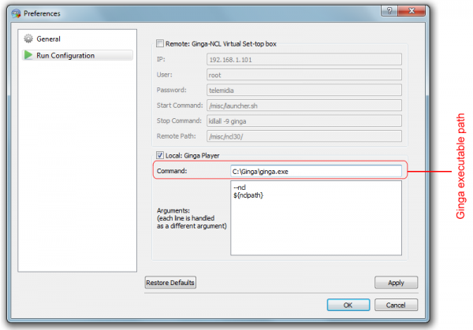
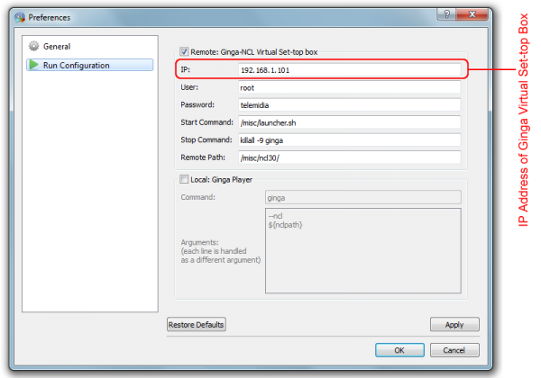
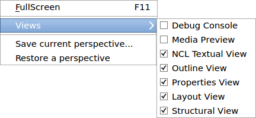
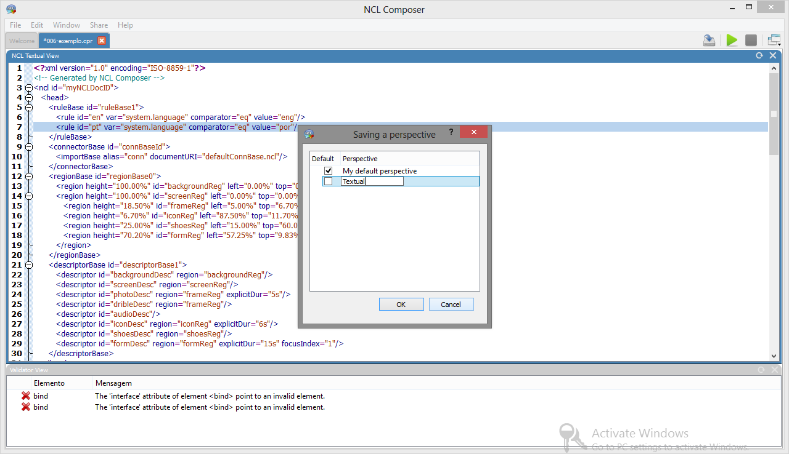
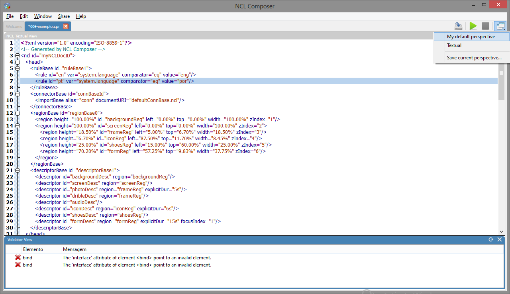

# Configurando {nclcomposer}
## Integração com o player NCL 

O {nclcomposer}, por _default_, não vem com um _player_ NCL embutido. Dessa
forma, para executar suas aplicações, será necessário que você tenha algum
player NCL instalado.

  > É recomendado o uso da [Implementação de Referência do
  > Ginga-NCL](http://www.ginga.org.br).

Existem duas formas principais de executar sua aplicação NCL a partir da
interface do {nclcomposer}:

 * No executável do Ginga-NCL instalado localmente; ou
 * em uma máquina remota (e.g. Ginga Virtual Set-top Box);

### Executando no Ginga-NCL localmente 
Para configurar o {nclcomposer} para executar em uma instalação local do Ginga
selecione o Menu: _Edit->Preferences->Run Configuration_.

Nessa janela, marque a opção _Local: Ginga Player_ e na caixa de texto
_Command_ coloque o caminho completo do executável Ginga-NCL.

A caixa de texto _Argument_ pode ser preenchida com os parâmetros que o
executável do Ginga-NCL será chamado. Deve-se colocar um parâmetro em cada
uma das linhas.

### Executando no Ginga-NCL Virtual Set-top Box 
Para executar no Ginga Virtual Set-top Box escolha a opção: _Remote: Ginga-NCL
Virtual Set-top Box_, conforme a figura a seguir:

Usualmente, o único parâmetro a ser modificado é o endereço IP da máquina
virtual contendo o _Ginga-NCL Virtual Set-top Box_. Só é sugerido modificar os
outros parâmetros caso você saiba exatamente o que está fazendo.

## Configurando a disposição das visões 

### Escondendo/exibindo visões 
É possível esconder ou mostrar cada uma das visões instaladas no {nclcomposer}
por meio do menu _Window->Views_:

### Criando novas perspectivas 

É possível organizar as diversas visões na tela clicando na barra de
título de cada visão, e arastando-a para dispô-la da melhor forma que lhe 
convier na tela. Depois de organizá-las, é possível salvar uma determinada
organização de plug-ins na tela uma *perspectiva*, de tal forma, que seja 
simples voltar àquela organização quando necessário.

Para salvar a disposição atual de _Visões_ como uma nova perspectiva, é
suficiente ir no menu _Windows->Perspectives->Save current perspective..._.
Outra alternativa é clicar no ícone _Change your current perspective_ na barra
de tarefas e depois em _Save current perspective..._:

Idependente de pelo menu _Windows_ ou pela barra de tarefas, após a seleção da
opção _Save current perspective..._ o {nclcomposer}, irá solicitar o nome da
nova perspectiva (permitindo também marcá-la como a perspectiva padrão) através 
da janela a seguir:

### Alternando entre perspectivas 

