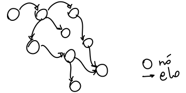

# Conceitos Básicos

A linguagem NCL---e consequentemente, o NCL Composer---baseiam-se no modelo NCM
(Nested Context Model) para modelar aplicações multimídia interativas.  No NCM,
aplicações multimídia são modeladas por meio de nós (__nodes__) e elos
(__links__) (Figura 1).

Os __nós de mídia__ representam os objetos de mídias da aplicação (vídeos,
imagens, textos etc.), enquanto os __elos__ representam relacionamentos entres
esses nós.  Exemplos de relacionamentos entre os nós são relacionamentos
causais (por exemplo, pode-se criar um elo entre dos objetos de mídia,
informando que quando a apresentação de um nó começar, a apresentação de outro
nó também deve ser iniciada).

Além dos nós de mídias, o NCM também permite agrupar nós e links em __nós de
composição__ (ou __contextos__), que permitem agrupar logicamente os nós e elos
de uma aplicação.  Contextos podem também agrupar outros contextos,
recursivamente (veja figura abaixo).

Modelar uma aplicação multimídia no NCM então é definir __quais__ os objetos de
mídia fazem parte da aplicação (através dos __nós de mídia__), __como__ eles
estão estruturados (definindo-se __nós de contextos__) e __quando__ esses objetos
de mídia serão apresentados (o que é realizado por meio da definição de __elos__
entre os nós de mídia).

# O software NCL Composer

O NCL Composer é uma feramenta de autoria para aplicações multimídia baseada no
NCM.  Por meio do NCL Composer é possível criar uma aplicação multimídia
através de diversas __visões__ sobre um documento NCL.  Cada visão traz alguma
representação (geralmente gráfica) que permite visualizar/editar uma
característica específica do documento NCL.

As principais visões do {nclcomposer} são: {default_views}.

