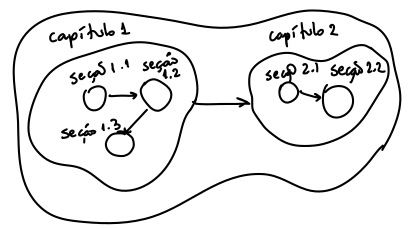

# Conceitos Básicos

A linguagem NCL---e, consequentemente, o NCL Composer---baseiam-se no modelo
NCM (Nested Context Model) para modelar aplicações multimídia interativas.
Esta seção discute os principais conceitos do NCM e da NCL, os quais são úteis
para utilizar o NCL Composer de forma eficiente.

## Nós e elos
#
No NCM, aplicações multimídia são modeladas por meio de nós (__nodes__) e elos
(__links__) (Figura 1).

Os __nós de mídia__ representam os objetos de mídias da aplicação (vídeos,
imagens, textos etc.), enquanto os __elos__ representam relacionamentos entres
esses nós.  Exemplos de relacionamentos entre os nós são os __relacionamentos
causais__ (por exemplo, no NCM é possível criar um elo entre dois nós,
informando que quando a apresentação de um nó começar, a apresentação de outro
nó também deve ser iniciada).

Além dos nós de mídias, o NCM também permite agrupar nós e links em __nós de
composição__ (ou __contextos__), que permitem agrupar logicamente os nós e elos
de uma aplicação.  Contextos podem também agrupar outros contextos,
recursivamente (veja figura abaixo).

Modelar uma aplicação multimídia no NCM então é definir __quais__ os objetos de
mídia fazem parte da aplicação (através dos __nós de mídia__), __como__ eles
estão estruturados (definindo-se __nós de contextos__) e __quando__ esses objetos
de mídia serão apresentados (o que é realizado por meio da definição de __elos__
entre os nós de mídia).

## Propriedades, regiões e descritores

Objetos de mídia podem conter um conjunto de __propriedades__.  Propriedades
definem várias características dos objetos de mídia, como, por exemplo, o seu
posicionamento (propriedades _top_ e _left_), a sua dimensão (propriedades
_width_ e _height_), a sua transparência (propriedade _transparency_) etc.
Para uma lista completa das propriedades suportadas pela NCL é possível
consultar o [NCL
Handbook](http://handbook.ncl.org.br/doku.php?id=property#predefined-properties).
Propriedades também podem ser modificadas dinamicamente durante a exibição do
objeto de mídia.

As propriedades de um objeto de mídia são definidas no próprio objeto de
mídia. Porém, a NCL também define dois outros elementos que possibilitam reusar
um conjunto de propriedades em mais de um objeto de mídia, são eles: a:
__descritores__ e __regiões__.

Um __descritor__ é usado para agrupar um conjunto qualquer de propriedades e,
assim, é possível compartilhá-las por mais de uma mídia.  Por exemplo, se duas
mídia tocam na mesma região da tela e com a mesma transparência, podemos criar
um descritor `meudescritor` que agrupa essas propriedades.  Em vez de
definí-las novamente para cada um dos objetos de mídia, cada objeto de mídia
pode apenas referenciar este descritor.

Uma __região__ permite agrupar o conjunto de propriedades espaciais de um
objeto de mídia.  Além disso, por meio de regiões também é mais fácil definir

## Portas e âncoras

## Conectores

# O software NCL Composer

O NCL Composer é uma feramenta de autoria para aplicações multimídia baseada no
NCM.  Por meio do NCL Composer é possível criar uma aplicação multimídia
através de diversas __visões__ sobre um documento NCL.  Cada visão traz alguma
representação diferente do documento NCL que permite visualizar/editar algumas
características específicas.

Atualmente, as principais visões do {nclcomposer} são: {default_views}.

