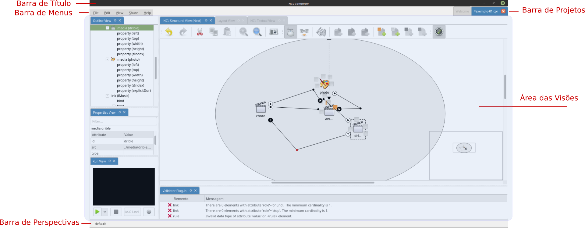
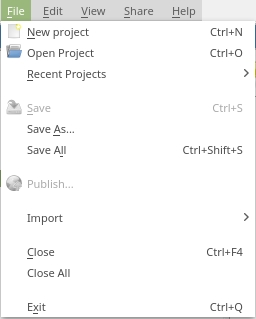
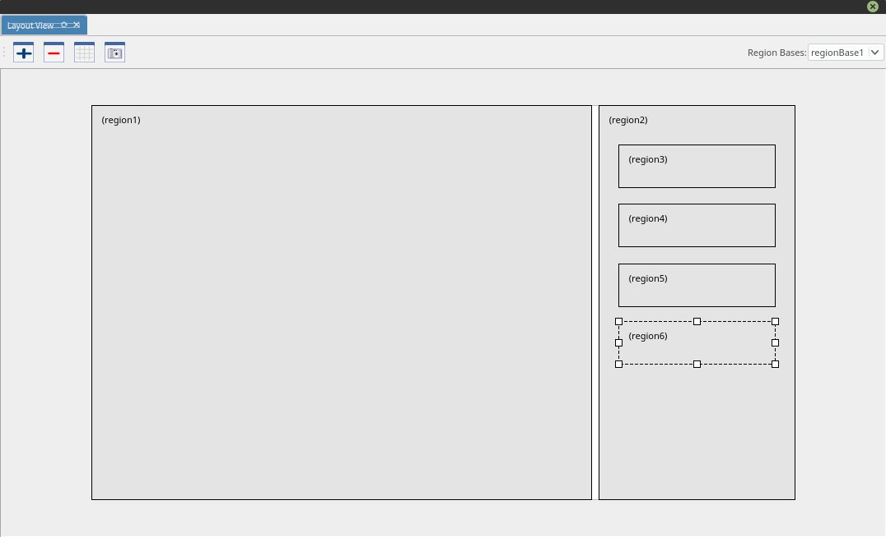
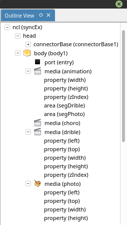
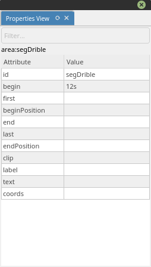
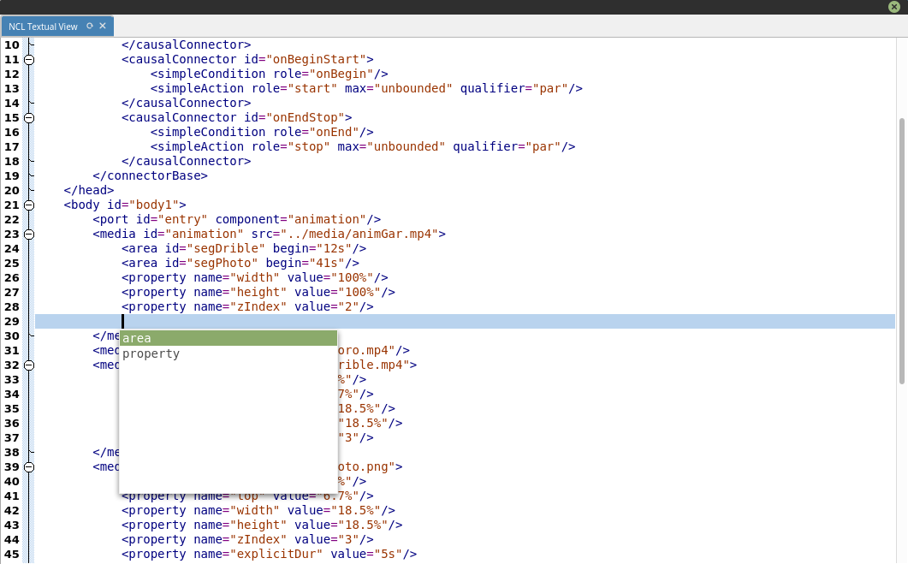
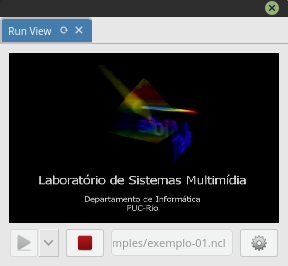

# Telas e Menus do {nclcomposer} #

## Janela Principal

### Barra de título ###
Evidencia o nome do {nclcomposer} e do projeto corrente.

### Barra de projetos
Lista a tela de boas-vindas e a lista de projetos abertos, permitindo navegar
entre eles.

### Área das Visões
Área de desenho das diversas visões. Cada visão pode ter seus próprios
elementos de interface. Também é possível organizar e salvar a disposição das
diversas visões por meio das perspectivas.

### Barra de perspectivas
Apresenta as perspectivas salvas pelo usuário e permite facilmente alternar
entre elas.

### Barra de menus

Mostra as entradas de menu disponíveis.

+-------------------------+----------------------------------------+
| Menu                    | Screnshot                              |
+=========================+========================================+
| __File__:  Da acesso às |   |
| seguintes opções:       |                                        |
|                         |                                        |
|                         |                                        |
| * Novo projeto          |                                        |
| * Abrir                 |                                        |
| * Salvar                |                                        |
+-------------------------+----------------------------------------+
| __Edit__:               |   |
+-------------------------+----------------------------------------+
| __View__:               |   |
+-------------------------+----------------------------------------+
| __Share__:              |  |
+-------------------------+----------------------------------------+
| __Help__:               |   |
+-------------------------+----------------------------------------+

### Atalhos

Os atalhos globais (válidos em qualquer visão) do {nclcomposer} são:

- __`Ctrl`+`n`__ - __Criar um novo projeto__.
- __`Ctrl`+`o`__ - __Abrir um novo projeto__.
- __`Ctrl`+`s`__ - __Salva o projeto corrente__.
- __`TODO`__ - __Salva o projeto corrente com outro nome__.
- __`Ctrl`+`Shift`+`s`__ - __Salva todos os projetos abertos__.
- __`Ctrl`+`F4`__ - __Fecha o projeto corrente__.
- __`Ctrl`+`Q`__ - __Fecha o {nclcomposer}__.
- __`F11`__ - __Habilita/desabilita visualização em tela cheia__.
- __`F1`__ - __Abre a ajuda do {nclcomposer}__.
- __`F5`__ - __Atualiza o modelo da visão que atualmente tem o foco__.

## {structural_view}

A {structural_view} permite que os autores de aplicações interajam visualmente
com a estrutura lógica do documento NCL. Em NCL, a estrutura lógica é
representada pelos seus objetos (nós de conteúdo e nós de composição) e os
elos entre esses objetos (representadas pelos elementos <link>).

### Ações

As ações são as diversas atividades que o usuário pode realizar durante o
processo de autoria. Uma ação pode ser executada de várias formas: através da
barra de ferramenta, do menu contextual, de um atalho de teclado, do *mouse* e
da combinação de várias dessas formas. Abaixo são descritas cada uma das ações
disponíveis na {structural_view} e como elas podem ser executadas.

+-------------+---------------------------------+-----------------------------+
| Ação        | Descrição                       |                             |
+=============+=================================+=============================+
| Desfazer    | Desfaz a última ação            | Esta ação pode ser          |
|             | realizada na visão. Esta        | executada através da:       |
|             | ação é ignorada caso não        | [barra de ferramentas]      |
|             | exista nenhuma ação para ser    | (#barra-de-ferramentas),    |
|             | defeita. *Inserir*, *remover*,  | [menu contextual](#menus) e |
|             | *mover* e *redimencionar* são   | [atalho](#atalhos).         |
|             | exemplos de ações que podem     |                             |
|             | ser desfeitas. Por outro lado,  |                             |
|             | selecionar não é uma ação       |                             |
|             | que pode ser desfeita. Na       |                             |
|             | versão atual, não existe um     |                             |
|             | limite na quantidade de ações   |                             |
|             | que podem ser desfeitas.        |                             |
+-------------+---------------------------------+-----------------------------+
| Refazer     | Refaz a última ação             | Esta ação pode ser          |
|             | realizada na visão. Esta        | executada através da:       |
|             | ação é ignorada caso não        | [barra de ferramentas]      |
|             | exista nenhuma ação para ser    | (#barra-de-ferramentas),    |
|             | refeita, ou seja, nenhuma       | [menu contextual](#menus) e |
|             | ação foi desfeita               | [atalho](#atalhos).         |
|             | anteriormente. Na versão        |                             |
|             | atual, não existe um limite na  |                             |
|             | quantidade de ações que podem   |                             |
|             | ser desfeitas.                  |                             |
+-------------+---------------------------------+-----------------------------+
| Recortar    | Copia a entidade selecionada    | Esta ação pode ser          |
|             | para a **área de                | executada através da:       |
|             | trânsferencia** e **remove**    | [barra de ferramentas]      |
|             | ela da visão. Esta ação é       | (#barra-de-ferramentas),    |
|             | ignorada caso nenhuma entidade  | [menu contextual](#menus) e |
|             | tenha sido selecionada e se a   | [atalho](#atalhos).         |
|             | entidade selecionada é do tipo  |                             |
|             | *body*.                         |                             |
+-------------+---------------------------------+-----------------------------+
| Copiar      | Copia a entidade selecionada    | Esta ação pode ser          |
|             | para a **área de                | executada através da:       |
|             | trânsferencia**. Esta ação      | [barra de ferramentas]      |
|             | é ignorada caso nenhuma         | (#barra-de-ferramentas),    |
|             | entidade tenha sido selecionada | [menu contextual](#menus) e |
|             | e se a entidade selecionada é   | [atalho](#atalhos).         |
|             | do tipo *body*.                 |                             |
+-------------+---------------------------------+-----------------------------+
| Colar       | Adiciona a entidade copiada     | Esta ação pode ser          |
|             | para *área de trânsferencia*    | executada através da:       |
|             | como filha da entidade          | [barra de ferramentas]      |
|             | selecionada. Esta ação é        | (#barra-de-ferramentas),    |
|             | ignorada caso nenhuma entidade  | [menu contextual](#menus) e |
|             | tenha sido recortada ou copiada | [atalho](#atalhos).         |
|             | e se a entidade selecionada     |                             |
|             | não permita que seja            |                             |
|             | adicionado como um de seus      |                             |
|             | filhos entidades do tipo        |                             |
|             | selecionada. Por exemplo, não   |                             |
|             | é possível colar um contexto    |                             |
|             | em uma mídia.                   |                             |
+-------------+---------------------------------+-----------------------------+
| Deletar     | Remove a entidade selecionada   | Esta ação pode ser          |
|             | da visão. Esta ação é           | executada através do:       |
|             | ignorada caso nenhuma entidade  | [menu contextual](#menus) e |
|             | esteja selecionada na visão.    | [atalho](#atalhos).         |
+-------------+---------------------------------+-----------------------------+
| Mover       | Move a entidade selecionada     | Esta ação pode ser          |
|             | para uma entidade de destino.   | executada através de        |
|             | Para a structural_view, mover   | [atalho](#atalhos).         |
|             | significa alterar o parêntesco  |                             |
|             | da entidade selecionada. A      |                             |
|             | entidade de destino é           |                             |
|             | determinada manipulando a       |                             |
|             | entidade selecionada por meio   |                             |
|             | de *drag-n-drop* para o         |                             |
|             | interior da entidade de         |                             |
|             | destino. Esta ação é            |                             |
|             | ignorada caso a entidade de     |                             |
|             | destino não permita que seja    |                             |
|             | adicionado como um de seus      |                             |
|             | filhos entidades do tipo        |                             |
|             | selecionado.                    |                             |
+-------------+---------------------------------+-----------------------------+
| Aumentar    | Aumenta o *zoom* na visão.      | Esta ação pode ser          |
| Zoom        | Esta ação é ignorada caso a     | executada através da:       |
|             | visão tenha alcançado seu       | [barra de ferramentas]      |
|             | *zoom* máximo.                  | (#barra-de-ferramentas) e   |
|             |                                 | [atalho](#atalhos).         |
+-------------+---------------------------------+-----------------------------+
| Diminuir    | Diminue o *zoom* na visão.      | Esta ação pode ser          |
| Zoom        | Esta ação é ignorada caso a     | executada através da:       |
|             | visão tenha alcançado seu       | [barra de ferramentas]      |
|             | *zoom* mínimo.                  | (#barra-de-ferramentas) e   |
|             |                                 | [atalho](#atalhos).         |
+-------------+---------------------------------+-----------------------------+
| Tirar uma   | Exporta o projeto como imagem   | Esta ação pode ser          |
| Foto        | (.png). O projeto pode ser      | executada através da:       |
|             | exportado mesmo que nenhuma     | [barra de ferramentas]      |
|             | entidade tenha sido adicionada. | (#barra-de-ferramentas) e   |
|             |                                 | [menu contextual](#menus).  |
+-------------+---------------------------------+-----------------------------+
| Habilitar   | Altera o modo de edição da      | Esta ação pode ser          |
| Ferramenta  | structural_view para            | executada através da:       |
| de Ponteiro | "ponteiro". Quando no modo de   | [barra de ferramentas]      |
|             | "ponteiro", a structural_view   | (#barra-de-ferramentas) e   |
|             | permite selecionar, mover e     | [atalho](#atalhos).         |
|             | redimencionar as entidades da   |                             |
|             | através do *mouse*. O modo de   |                             |
|             | "ponteiro" é desabilitado       |                             |
|             | sempre o modo de *"link"* é     |                             |
|             | habilitado.                     |                             |
+-------------+---------------------------------+-----------------------------+
| Habilitar   | Altera o modo de edição da      | Esta ação pode ser          |
| Ferramenta  | structural_view para *"link"*.  | executada através da:       |
| de Link     | Quando no modo de *"link"*, a   | [barra de ferramentas]      |
|             | structural_view permite criar   | (#barra-de-ferramentas) e   |
|             | *links* (relacionamentos) entre | [atalho](#atalhos).         |
|             | duas entidades. Para criar um   |                             |
|             | novo *link*, o usuário deve:    |                             |
|             | **i)** clicar com o botão       |                             |
|             | esquerdo do *mouse* na entidade |                             |
|             | de origem, **ii)** arrastar o   |                             |
|             | *mouse* até a entidade de       |                             |
|             | destino e, em seguida, **iii)** |                             |
|             | soltar o botão esquerdo do      |                             |
|             | *mouse*. O modo de *"link"* é   |                             |
|             | desabilitado sempre o modo de   |                             |
|             | "ponteiro" é habilitado. <em>   |                             |
|             | Caso seja permitido criar um    |                             |
|             | relaciomaneto entre as          |                             |
|             | entidades de origem e destino,  |                             |
|             | uma caixa de diálogo será       |                             |
|             | apresentada para finalizar o    |                             |
|             | processo de criação de          |                             |
|             | *link*. Caso contrário, a       |                             |
|             | ação é ignorada. Detalhes       |                             |
|             | sobre o [diálogo de             |                             |
|             | criação](#links) de *link*      |                             |
|             | será discutido mais a frente.   |                             |
|             | </em>                           |                             |
+-------------+---------------------------------+-----------------------------+
| Criar uma   | Adiciona uma entidade do tipo   | Esta ação pode ser          |
| Mídia       | mídia como filha da entidade    | executada através da:       |
|             | selecionada. Esta ação é        | [barra de ferramentas]      |
|             | ignorada caso a entidade        | (#barra-de-ferramentas),    |
|             | selecionada não permita que     | [menu contextual](#menus) e |
|             | seja adicionada como um de seus | [atalho](#atalhos).         |
|             | filhos entidades do tipo        |                             |
|             | mídia.                          |                             |
+-------------+---------------------------------+-----------------------------+
| Criar uma   | Adiciona uma entidade do tipo   | Esta ação pode ser          |
| Contexto    | contexto como filha da entidade | executada através da:       |
|             | selecionada. Esta ação é        | [barra de ferramentas]      |
|             | ignorada caso a entidade        | (#barra-de-ferramentas),    |
|             | selecionada não permita que     | [menu contextual](#menus) e |
|             | seja adicionada como um de seus | [atalho](#atalhos).         |
|             | filhos entidades do tipo        |                             |
|             | contexto.                       |                             |
+-------------+---------------------------------+-----------------------------+
| Criar um    | Adiciona uma entidade do tipo   | Esta ação pode ser          |
| *Switch*    | *switch* como filha da entidade | executada através da:       |
|             | selecionada. Esta ação é        | [barra de ferramentas       |
|             | ignorada caso a entidade        | ](#barra-de-ferramentas),   |
|             | selecionada não permita que     | [menu contextual](#menus) e |
|             | seja adicionada como um de seus | [atalho](#atalhos).         |
|             | filhos entidades do tipo        |                             |
|             | *switch*.                       |                             |
+-------------+---------------------------------+-----------------------------+
| Criar o     | Adiciona uma entidade do tipo   | Esta ação pode ser          |
| *Body*      | *body* na visão. Esta ação      | executada através da:       |
|             | é ignorada caso um *body* já    | [barra de ferramentas       |
|             | tenha sido adicionado           | ](#barra-de-ferramentas),   |
|             | previamente.                    | [menu contextual](#menus) e |
|             |                                 | [atalho](#atalhos).         |
+-------------+---------------------------------+-----------------------------+
| Criar uma   | Adiciona uma entidade do tipo   | Esta ação pode ser          |
| Área        | área como filha da entidade     | executada através da:       |
|             | selecionada. Esta ação é        | [barra de ferramentas       |
|             | ignorada caso a entidade        | ](#barra-de-ferramentas),   |
|             | selecionada não permita que     | [menu contextual](#menus) e |
|             | seja adicionada como um de seus | [atalho](#atalhos).         |
|             | filhos entidades do tipo área.  |                             |
+-------------+---------------------------------+-----------------------------+
| Criar uma   | Adiciona uma entidade do tipo   | Esta ação pode ser          |
| Propriedade | propriedade como filha da       | executada através da:       |
|             | entidade selecionada. Esta      | [barra de ferramentas       |
|             | ação é ignorada caso a          | ](#barra-de-ferramentas),   |
|             | entidade selecionada não        | [menu contextual](#menus) e |
|             | permita que seja adicionada     | [atalho](#atalhos).         |
|             | como um de seus filhos          |                             |
|             | entidades do tipo propriedade.  |                             |
+-------------+---------------------------------+-----------------------------+
| Criar uma   | Adiciona uma entidade do tipo   | Esta ação pode ser          |
| Porta       | porta como filha da entidade    | executada através da:       |
|             | selecionada. Esta ação é        | [barra de ferramentas       |
|             | ignorada caso a entidade        | ](#barra-de-ferramentas),   |
|             | selecionada não permita que     | [menu contextual](#menus) e |
|             | seja adicionada como um de seus | [atalho](#atalhos).         |
|             | filhos entidades do tipo porta. |                             |
+-------------+---------------------------------+-----------------------------+
| Criar uma   | Adiciona uma entidade do tipo   | Esta ação pode ser          |
| Porta de    | porta de *switch* como filha da | executada através da:       |
| *Switch*    | entidade selecionada. Esta      | [barra de ferramentas       |
|             | ação é ignorada caso a          | ](#barra-de-ferramentas),   |
|             | entidade selecionada não        | [menu contextual](#menus) e |
|             | permita que seja adicionada     | [atalho](#atalhos).         |
|             | como um de seus filhos          |                             |
|             | entidades do tipo porta de      |                             |
|             | *switch*.                       |                             |
+-------------+---------------------------------+-----------------------------+
| Habilitar/  | Habilita/Desabilita o minimapa. | Esta ação pode ser          |
| Desabilitar | Quando habilitado, o minimapa   | executada através da:       |
| Minimapa    | é exibido no canto inferior     | [barra de ferramentas       |
|             | direito da visão.               | ](#barra-de-ferramentas) e  |
|             |                                 | [atalho](#atalhos).         |
+-------------+---------------------------------+-----------------------------+

### Barra de Ferramentas

A partir da versão 0.3.0 a {structural_view} disponibiliza uma *barra de
ferramentas* para facilitar o processo de autoria. 

A figura acima apresenta a *barra de ferramentas*, cujo detalhes de cada
ferramenta são descritos a seguir:

- **(a) - Desfazer:** Desfaz a última ação realizada na visão. [Mais
                      detalhes](#ações).
- **(b) - Refazer:** Refaz a última ação reallizada na visão. [Mais
                     detalhes](#ações).
- **(c) - Recortar:** Copia a entidade selecionada para a **área de
		      trânsferencia** e **remove** ela da visão. [Mais
                      detalhes](#ações).
- **(d) - Copiar:** Copia a entidade selecionada para a **área de
                    trânsferencia**. [Mais detalhes](#ações).
- **(e) - Colar:** Adiciona a entidade copiada para *área de trânsferencia*
                   como filha da entidade selecionada. [Mais detalhes](#ações).
- **(f) - Aumentar o *Zoom:*** Aumenta o *Zoom* na visão. [Mais
                               detalhes](#ações).
- **(g) - Diminuir o *Zoom:*** Diminue o *Zoom* na visão. [Mais
                               detalhes](#ações).
- **(h) - Tirar uma Foto:** Exporta o projeto como imagem (.png). [Mais
                            detalhes](#ações).
- **(i) - Ferramenta de Ponteiro:** Altera o modo de edição da visão para
                                    "ponteiro". [Mais detalhes](#ações).
- **(j) - Ferramenta de *Link*:** Altera o modo de edição da visão para "link".
                                  [Mais detalhes](#ações).
- **(k) - Adicionar Mídia:** Adiciona uma entidade do tipo mídia como filha da
                             entidade selecionada. [Mais detalhes](#ações).
- **(l) - Adicionar Contexto:** Adiciona uma entidade do tipo context como
				filha da entidade selecionada. [Mais
                                detalhes](#ações).
- **(m) - Adicionar *Switch*:** Adiciona uma entidade do tipo *switch* como
				filha da entidade selecionada. [Mais
                                detalhes](#ações).
- **(n) - Adicionar *Body*:** Adiciona um *body* na visão. [Mais
                              detalhes](#ações).
- **(o) - Adicionar Área:** Adiciona uma entidade do tipo área como filha da
                            entidade selecionada. [Mais detalhes](#ações).
- **(p) - Adicionar Propriedade:** Adiciona uma entidade do tipo propriedade
				   como filha da entidade selecionada. [Mais
                                   detalhes](#ações).
- **(q) - Adicionar Porta:** Adiciona uma entidade do tipo porta como filha da
                             entidade selecionada. [Mais detalhes](#ações).
- **(r) - Adicionar Porta de *Switch*:** Adiciona uma entidade do tipo porta de
					 *switch* como filha da entidade
					 selecionada. [Mais detalhes](#ações).

### Menus

#### Menu Contextual

O menu contextual é exibido sempre que o usuário clica com o botão direito do
*mouse* em qualquer entidade ou nas áreas vazias (em branco) da visão. 

A figura acima apresenta o *menu contextual*, cujo detalhes são descritos
abaixo:

- **(a) - Exibir Ajuda:** Exibe o diálogo de ajuda. **Desabilitado nesta
                          versão**.
- **(b) - Insert:** Exibe o submenu de adção de entidades.
- **(c) - Desfazer:** Desfaz a última ação realizada na visão. [Mais
                      detalhes](#ações).
- **(d) - Refazer:** Refaz a última ação reallizada na visão. [Mais
                     detalhes](#ações).
- **(e) - Recortar:** Copia a entidade selecionada para a **área de
		      trânsferencia** e **remove** ela da visão. [Mais
                      detalhes](#ações).
- **(f) - Copiar:** Copia a entidade selecionada para a **área de
                    trânsferencia**. [Mais detalhes](#ações).
- **(g) - Colar:** Adiciona a entidade copiada para *área de trânsferencia*
		   como filha da entidade selecionada. [Mais detalhes](#ações).
- **(h) - Deletar:** Remove a entidade selecionada da visão. [Mais
                     detalhes](#ações).
- **(i) - Tirar uma Foto:** Exporta o projeto como imagem (.png). [Mais
                            detalhes](#ações).
- **(j) - Exibir Propriedades:** Exibe o diálogo de propriedades. **Desabilitado
                                 nesta versão**
- **(k) - Adicionar Mídia:** Adiciona uma entidade do tipo mídia como filha da
                             entidade selecionada. [Mais detalhes](#ações).
- **(l) - Adicionar Contexto:** Adiciona uma entidade do tipo context como
				filha da entidade selecionada. [Mais
                                detalhes](#ações).
- **(m) - Adicionar *Switch*:** Adiciona uma entidade do tipo *switch* como
				filha da entidade selecionada. [Mais
                                detalhes](#ações).
- **(n) - Adicionar *Body*:** Adiciona um *body* na visão. [Mais
                              detalhes](#ações).
- **(o) - Adicionar Área:** Adiciona uma entidade do tipo área como filha da
                            entidade selecionada. [Mais detalhes](#ações).
- **(p) - Adicionar Propriedade:** Adiciona uma entidade do tipo propriedade
				   como filha da entidade selecionada. [Mais
                                   detalhes](#ações).
- **(q) - Adicionar Porta:** Adiciona uma entidade do tipo porta como filha da
                             entidade selecionada. [Mais detalhes](#ações).
- **(r) - Adicionar Porta de *Switch*:** Adiciona uma entidade do tipo porta de
					 *switch* como filha da entidade
                                         selecionada. [Mais detalhes](#ações).

### Diálogos

#### Diálogo de Link

O diálogo de *link* é utilizado para criação e edição de: *links*, *binds*,
parâmetros de *link* e parâmetros de *binds*. O diálogo para criação de *link*
é exibido quando um relacionamento entre uma entidade de origem e destino é
especificado através da [ferramenta de criação de *link*](#ações). 

Logo que exibido (figura abaixo), o diálogo de *link* apresenta uma lista de
conectores para que o usuário possa escolher. A lista de conectores é carregada
dinâmicamente a partir das especificações da aplicação em desenvolvimento.

Assim que o usuário começar a preencher a caixa de texto *"connector"* (figura
abaixo), a lista de conectores é filtrada para facilitar a seleção do conector
apropriado.

Uma vez selecionado um dos conectores na lista, o usuário pode escolher qual o
tipo de condição e ação na seção de *binds* do diálogo (figura abaixo). Os
tipos de condições e ações disponíveis são carregados a patir do conector
selecionado. 

Ainda na criação do *link*, quando o usuário habilita a exibição de parâmetros
(*"show params"*), é possível especificar os valores dos parâmetros de *link*,
parâmetros do *bind* de condição e parâmetros do *bind* de ação (figura abaixo)
que devem ser considerados para criação do relacionamento.

Para editar os parâmetros de um *link*, o usuário deve clicar duas vezes na
entidade do tipo *link* na visão. Esta ação resultana exibição do diálogo
abaixo.

De modo semelhante, para editar um *bind*, o usuário deve clicar duas vezes na
entidade do tipo *bind*, resultando na exibição do diálogo abaixo.

")

#### Referência

É possível especificar uma referência através da ação de [colar](#ações). Assim
que a ação de colar é realizada o diálogo abaixo é exibido, solicitando que o
autor escolha entre copiar ou criar uma referência da entidade copiada para
*área de tranferência*.

Quando uma entidade é uma referência, ela fica levemente transparente (figura
abaixo) e herda todas as interfaces da entidade referenciada. Não é possível
referenciar uma entidade que já referencia uma outra. Nesta versão ainda não é
possível fazer referência para entidades do tipo: contexto, *switch* e *body*.

### Atalhos

Abaixo segue a lista de atalhos da {structural_view}:

- __`Ctrl`+`z`__ - __Desfazer__: Desfaz a última ação realizada na visão. [Mais
  detalhes](#ações).
- __`Ctrl`+`Shift`+`z`__ - __Refazer__: Refaz a última ação reallizada na
  visão. [Mais detalhes](#ações).
- __`Ctrl`+`x`__ - __Recortar__: Copia a entidade selecionada para a **área de
  trânsferencia** e **remove** ela da visão. [Mais detalhes](#ações).
- __`Ctrl`+`c`__ - __Copiar__: Copia a entidade selecionada para a **área de
  trânsferencia**. [Mais detalhes](#ações).
- __`Ctrl`+`v`__ - __Colar__: Adiciona a entidade da *área de trânsferencia*
  como filha da entidade selecionada. [Mais detalhes](#ações).
- __`Del`__ - __Deletar__: Remove a entidade selecionada da visão. [Mais
  detalhes](#ações).
- __*Segurar* `Ctrl`+*Drag-n-drop*__  - Mover: Remove a entidade selecionada da
  visão. [Mais detalhes](#ações).
- __`Ctrl`+`+`__ ou __`Ctrl`+*Roda do mouse para cima*__ - __Aumentar o
  *zoom*__: Aumenta o *zoom* na visão. [Mais detalhes](#ações).
- __`Ctrl`+`-`__ ou __`Ctrl`+*Roda do mouse para baixo*__ - __Diminuir o
  *zoom*__: Diminue o *zoom* na visão. [Mais detalhes](#ações).
- __`1`__ - __Habilitar Ferramenta de Ponteiro__: Altera o modo de edição da
visão para
  "ponteiro". [Mais detalhes](#ações).
- __`2`__ ou __*Segurar* `Shift`__ - Habilitar Ferramenta de *Link*: Altera o
  modo de edição da visão para "link". [Mais detalhes](#ações).
- __`3`__ - __Adicionar Mídia__: Adiciona uma entidade do tipo mídia como filha
  da entidade selecionada. [Mais detalhes](#ações).
- __`4`__ - __Adicionar Contexto__: Adiciona uma entidade do tipo context como
  filha da entidade selecionada. [Mais detalhes](#ações).
- __`5`__ - __Adicionar *Switch*__: Adiciona uma entidade do tipo *switch* como
  filha da entidade selecionada. [Mais detalhes](#ações).
- __`6`__ - __Adicionar *Body*__: Adiciona um *body* na visão. [Mais
  detalhes](#ações).
- __`7`__ - __Adicionar Área__: Adiciona uma entidade do tipo área como filha da
  entidade selecionada. [Mais detalhes](#ações).
- __`8`__ - __Adicionar Propriedade__: Adiciona uma entidade do tipo
  propriedade como filha da entidade selecionada. [Mais detalhes](#ações).
- __`9`__ - __Adicionar Porta__: Adiciona uma entidade do tipo porta como filha
  da entidade selecionada. [Mais detalhes](#ações).
- __`0`__ - __Adicionar Porta de *Switch*__: Adiciona uma entidade do tipo
  porta de *switch* como filha da entidade selecionada. [Mais
  detalhes](#ações).
- __`Ctrl`+`m`__ - __Habilitar/Desabilitar Minimapa__: Habilita/Desabilita o
  minimapa. [Mais detalhes](#ações).

### Outros detalhes

Todo plugins do {nclcomposer} permite sincronizar (ou resincronizar) o estado
atual da visão com o modelo do núcleo da ferramenta. Esta tarefa é realiza
através de um botão na aba de cada visão. No caso da {structural_view}, sempre
que a visão é resincronizada com o modelo do núcleo da ferramenta, todo o
histório de ações é perdido, de modo que não é possível desfazer ou refazer uma
ação.

## {layout_view}

A {layout_view} permite que os autores de aplicações NCL interajam visualmente
com as regiões onde os objetos de mídia serão inicialmente apresentados. Nesta
visão, os autores podem criar e manipular as regiões e a hierarquia de regiões
do documento.

+-----------------+---------------------------------+-----------------------------+
| Ação            | Descrição                       |                             |
+=================+=================================+=============================+
| Criar uma       | Cria uma nova região, filha     | Esta ação pode ser          |
| região          | região que está selecionada.    | executada através da:       |
+-----------------+---------------------------------+-----------------------------+
| Remover uma     | Remove a região que está        | Esta ação pode ser          |
| região          | atualmente selecionada e seus   | executada através da:       |
|                 | filhos.                         | [barra de ferramentas]      |
+-----------------+---------------------------------+-----------------------------+
| Copiar região   | Copia a região selecionada      | Esta ação pode ser          |
|                 | para a **área de                | executada através da:       |
|                 | trânsferencia**. Esta ação      | [barra de ferramentas]      |
|                 | é ela da visão. Esta ação       | (#barra-de-ferramentas),    |
|                 | é ignorada caso nenhuma         | [menu contextual](#menus) e |
|                 | entidade esteja selecionada.    | [atalho](#atalhos).         |
+-----------------+---------------------------------+-----------------------------+
| Colar região    | Cola a região que está na       | Esta ação pode ser          |
|                 | **área de transferência**       | executada através da:       |
|                 | como filha da região            | [barra de ferramentas]      |
|                 | selecionada.                    | (#barra-de-ferramentas),    |
|                 |                                 | [menu contextual](#menus) e |
|                 |                                 | [atalho](#atalhos).         |
+-----------------+---------------------------------+-----------------------------+
| Esconder        | Esconde a região atualmente     | Esta ação pode ser          |
| região          | selecionada da visão de         | executada através da:       |
|                 | leiaute. A região continua      | [barra de ferramentas]      |
|                 | existindo no modelo (e pode ser | (#barra-de-ferramentas),    |
|                 | mostrada depois) apenas não é   | [menu contextual](#menus) e |
|                 | visualizada.                    | [atalho](#atalhos).         |
+-----------------+---------------------------------+-----------------------------+
| Mostrar/esconde | Copia a entidade selecionada    | Esta ação pode ser          |
| r grade         | para a **área de                | executada através da:       |
|                 | trânsferencia**. Esta ação      | [barra de ferramentas]      |
|                 | é ignorada caso nenhuma         | (#barra-de-ferramentas),    |
|                 | entidade tenha sido selecionada | [menu contextual](#menus) e |
|                 | e se a entidade selecionada é   | [atalho](#atalhos).         |
|                 | do tipo *body*.                 |                             |
+-----------------+---------------------------------+-----------------------------+
| Tirar um        | Permite salvar uma imagem com a | Esta ação pode ser          |
| instantâneo     | disposição atual das regiões    | executada através da:       |
|                 | da visão de leiaute.            | [barra de ferramentas]      |
|                 |                                 | (#barra-de-ferramentas),    |
|                 |                                 | [menu contextual](#menus) e |
|                 |                                 | [atalho](#atalhos).         |
+-----------------+---------------------------------+-----------------------------+

## {outline_view}

A {outline_view} apresenta a estrutura do documento NCL como uma árvore,
permitindo aos autores navegarem no documento.

## {properties_view}

A {properties_view} apresenta o conjunto de propriedades da entidade
selecionada. Essa entidade selecionada por ser, por exemplo, uma região na
{layout_view}, um objeto de mídia na {structural_view} etc.

## {textual_view}

A __{textual_view}__ permite aos usuários interagirem diretamente com o
código-fonte da aplicação NCL. Ela é um editor de texto avançado focado na
linguagem NCL e traz funcionalidades como: coloração sintática, sugestão de
código contextual e formatação de código.

A _{textual_view}_ é recomendada especialmente para usuários avançados e que se
sentem à vontade com a sintaxe XML.

## {rules_view}

Permite a definição de uma base de regras, as quais podem ser utilizada em
*switchs* para adaptação do conteúdo a ser apresentado.

## {validator}

O validador é responsável por notificar erros e alertas no documento NCL.
A figura a seguir apresenta um exemplo.

## {run_view}

Possibilita ver o resultado da execução do seu projeto.

