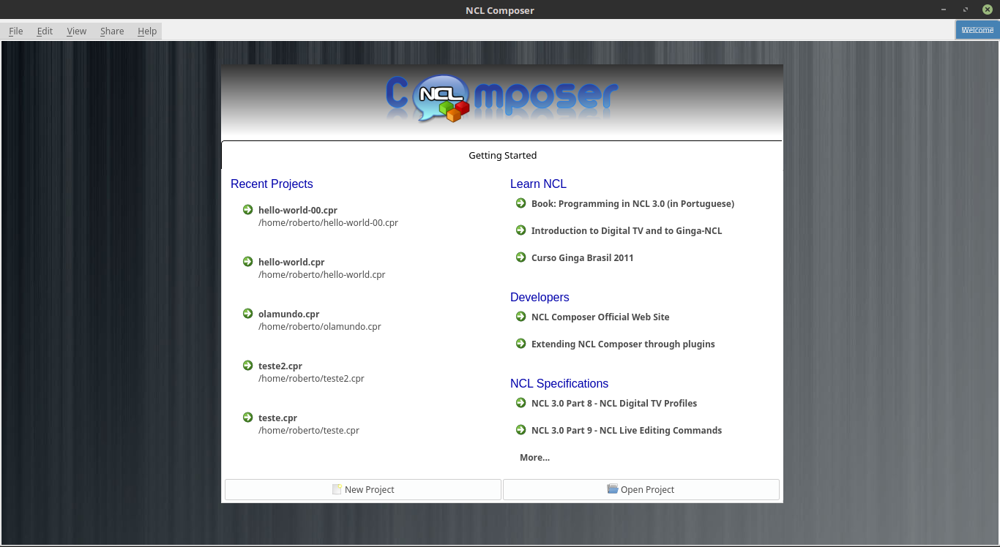
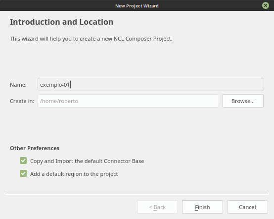
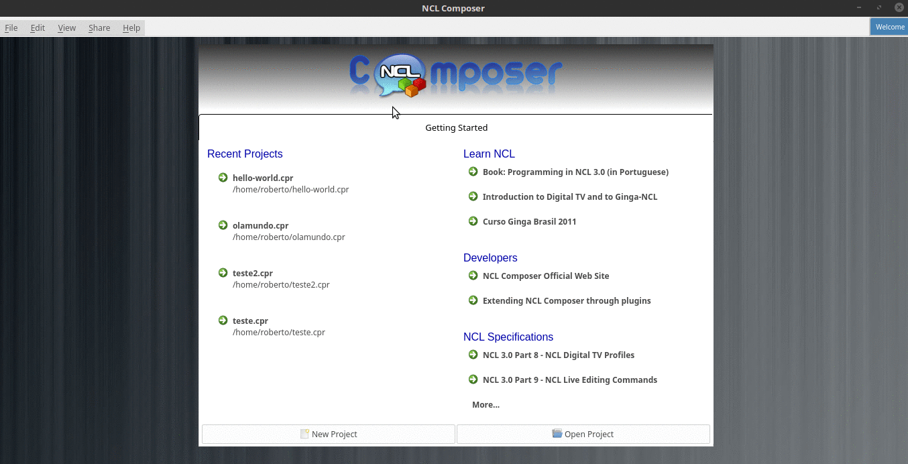
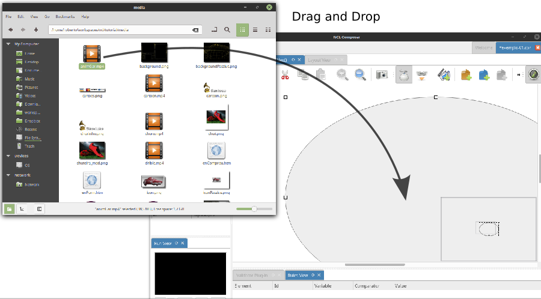
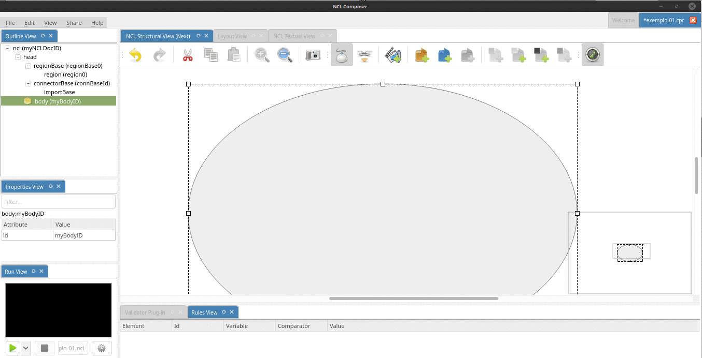
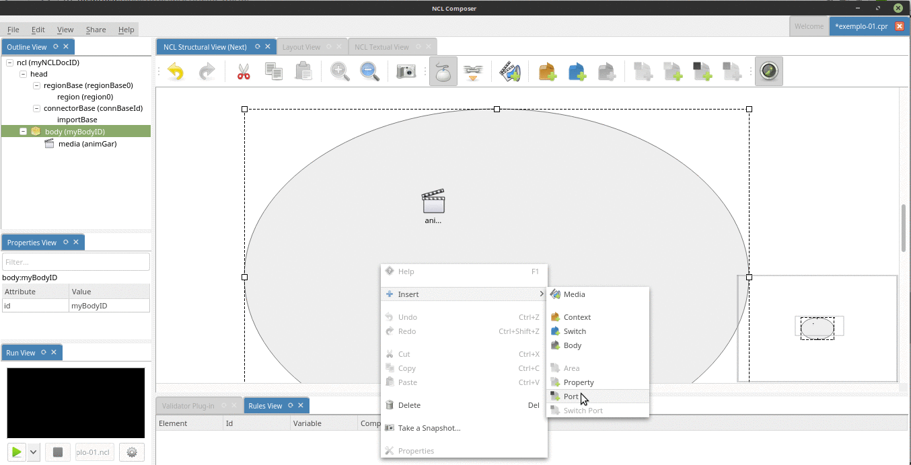
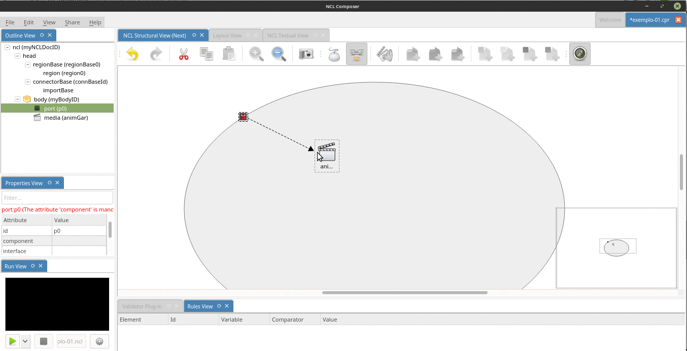
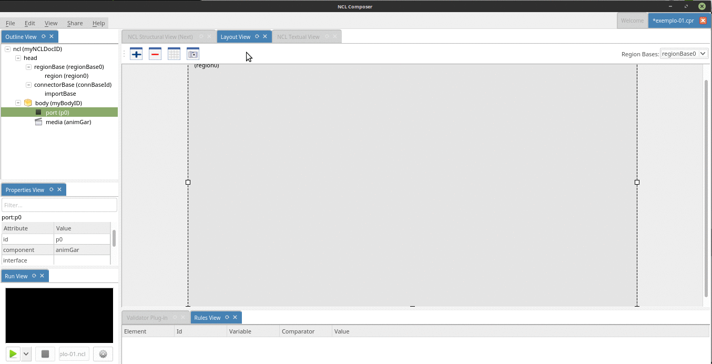

# Exemplo 01: Reproduzindo um objeto de mídia ##

## Objetivo
Neste primeiro exemplo, o objetivo é apenas exibir um objeto de mídia, em tela
cheia.

Para isso, iremos:

  * Criar um novo projeto;
  * Adicionar o objeto de mídia (no exemplo, usaremos um vídeo) na aplicação;
  * Informar que esse objeto será iniciado quando a aplicação começar, e
  * Determinar a região da tela onde esse objeto de mídia será exibido.

## Passo 0: Criando um novo projeto

Para criarmos o nosso exemplo, o primeiro passo é criarmos um novo projeto.

Ao abrir o {nclcomposer}, a seguinte tela de boas-vindas é apresentada:

Nessa tela, é possível criar um novo projeto por meio do menu
_File->New Project_, por meio do botão _New Project_ no canto esquerdo
inferior da tela de boas-vindas, ou simplesmente pressionando _Ctrl+N_.

Feito isso, a seguinte janela será exibida:

Atribua um nome para o projeto que você está criando (aqui atribuímos o nome
_exemplo-01_), selecione o diretório onde deseja salvá-lo e deixe as opções
_Copy and Import the default Connector Base_ (Copie e importe a base de
conectores padrão) e _Add a default region to the project_ (adicione uma região
padrão ao projeto) selecionadas. 

> **NOTA** Nas próximas seções serão discutidos em detalhes o que são os >
> conectores e tbases de conectores. Por enquanto, apenas deixe esta > opção
> marcada, pois ela será útil para os próximos exemplos.

Por fim, pressione o botão _Finish_, e o seu novo projeto será criado e aberto.

A animação a seguir exemplifica a criação de um projeto.

Ao criar o novo projeto, o {nclcomposer} irá automaticamente abrí-lo, onde
teremos acesso às visões: {default_views}.

## Passo 1: Adicionando um objeto de mídia (**O que?**)

Com o nosso projeto criado e aberto, podemos começar a desenvolver a nossa
aplicação.  Como primeiro passo, temos que adicionar o objeto de mídia da nossa
aplicação (neste primeiro exemplo, teremos apenas um objeto de mídia, um vídeo).

Para inserir os objetos de mídia (áudio, vídeo, imagens etc.) em nossa
aplicação, a forma mais simples é apenas arrastá-los do seu gerenciador de
arquivos para dentro da {structural_view} do {nclcomposer}.

> **DICA:** Outra forma de inserir um objeto de mídia, na {structural_view} é
> clicar com o botão direito sobre o corpo do documento e selecionar o menu
> _Insert -> Media_. Neste caso, é importante não esquecer de definir o caminho
> para o objeto de mídia, o que poder ser realizado selecionando o objeto que
> você acabou de editar e alterando o valor do atributo _src_ (ou na _Visão de
> Propriedades_ ou na _Visão Textual_).

A animação a seguir, exemplica como podemos adicionar um novo objeto de mídia,
arrastando a partir do gerenciador de arquivos.

## Passo 2: Informando o objeto de mídia que serão inicialmente exibidos (**Quando?**)

Para informar que o objeto de mídia que acabamos de inserir deve iniciar
quanto a nossa aplicação iniciar, é suficiente criarmos uma __porta__ no corpo
do documento, mapeando-a para o objeto de mídia.  As portas de um contexto
(inclusive do corpo do documento, que nada mais é do que o contexto inicial do
documento) definem quais os objetos daquele contexto serão iniciados quando
aquele contexto for iniciado.

Para inserirmos uma porta no corpo do documento pela _Visão Estrutural_ é
suficiente clicarmos com o botão direito sobre o corpo e selecionarmos o menu
_Insert->Port_.

Para mapearmos a porta que acabamos de criar para o objeto de mídia, podemos
selecionar a ferramenta _Link_ na barra de tarefas e clicar sobre a porta e,
mantendo o botão do mouse pressionado, arrastar o ponteiro até o objeto de
mídia.

> **NOTA** Outra forma de ativar a ferramenta _Link_ é segurando a tecla SHIFT
> enquanto faz-se o mesmo procedimento acima.

Com isso, já definimos que nossa aplicação é constituída apenas de um objeto de
mídia e que quando a aplicação começar, esse objeto de mídia será executado.

A animação a seguir exemplica como criar e mapear uma porta no corpo do
documento.

## Passo 3: Definindo a região onde o objeto de mídia será apresentado (**Onde?**)

Para finalizar este primeiro exemplo só falta agora definirmos __onde__ (em
que região da tela) o objeto de mídia da nossa aplicação será exibido. 

Como ao criarmos o nosso projeto, deixamos a opção _"Add a default region to the
project"_ selecionada, ao criarmos o projeto já criamos também uma região que
ocupa toda a tela.

Para associarmos a mídia que adicionamos no nosso projeto à essa região, basta
arrastamos essa mídia (por exemplo, a partir da __visão de outline__) para a
região na visão de leiaute.  Veja a animação a seguir:

Ao fazermos isso, o {nclcomposer} irá nos perguntar se queremos "copiar os
dados da região" para a mídia ou se queremos criar um descritor.  Um descritor
serve para podermos reusar as mesmas propriedades em mais de uma mídia.  Exemplos
destas propriedade são o posicionamento e a largura e a altura do objeto de mídia.
Na grande maioria das vezes (inclusive aqui) iremos querer criar um descritor.

## Passo 4: Executando o exemplo
Feito isso, o nosso primeiro exemplo já está completo.

Para executá-lo, basta executar o projeto no botão "Run NCL Project"
 na _Run view_.

