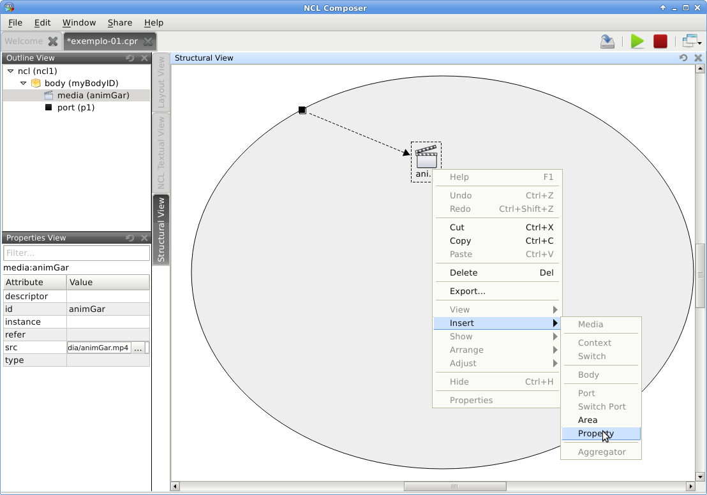

## Exemplo 1: Reproduzindo um objeto de mídia ##

### Objetivo ###
Neste primeiro exemplo, o objetivo é apenas exibir um objeto de mídia, em tela
cheia.

### Passo 0: Criando um novo projeto

Para criarmos o nosso exemplo, o primeiro passo é criarmos um novo projeto.

Ao abrir o {nclcomposer}, a seguinte tela de boas-vindas é apresentada:

É possível criar um novo projeto por meio do menu _File->New Project_.

> NOTA: Outra possibilidade para criar um novo projeto é por meio do o botão
> _New Project_ no canto esquerdo inferior da tela de boas-vindas.

Feito isso, a seguinte janela será exibida:

Atribua um nome para o projeto que você está criando (aqui atribuímos o nome
_exemplo-01_), selecione o diretório onde deseja salvá-lo e deixe as opções
_Copy and Import the default Connector Base_ (Copie e importe a base de
conectores padrão) e _Add a default region to the project_ (adicione uma região
padrão ao projeto) selecionadas. 

> **NOTA** Nas próximas seções serão discutidos em detalhes o que são os 
> conectores e também as bases de conectores. Por enquanto, apenas deixe esta 
> opção marcada, pois ela será útil para os próximos exemplos.

Por fim, pressione então o botão _Finish_, e o seu novo projeto será criado e aberto.

A animação a seguir exemplifica a criação de um projeto.

Ao criar o novo projeto, o {nclcomposer} irá automaticamente abrí-lo, onde
teremos acesso às visões: {default_views}.

### Passo 1: Adicionando um objeto de mídia (**O que?**)

Com o nosso projeto criado e aberto, podemos começar a desenvolver a nossa
aplicação.  Como primeiro passo, temos que adicionar o objeto de mídia da nossa
aplicação (neste primeiro exemplo, teremos apenas um objeto de mídia, um vídeo).

Para inserir os objetos de mídia (áudio, vídeo, imagens etc.) em nossa
aplicação, a forma mais simples é apenas arrastá-los do seu gerenciador de
arquivos para dentro da {structural_view} do {nclcomposer}.

> **DICA:** Outra forma de inserir um objeto de mídia, na {structural_view} é
> clicar com o botão direito sobre o corpo do documento e selecionar o menu
> _Insert -> Media_. Neste caso, é importante não esquecer de definir o caminho
> para o objeto de mídia, o que poder ser realizado selecionando o objeto que
> você acabou de editar e alterando o valor do atributo _src_ (ou na _Visão de
> Propriedades_ ou na _Visão Textual_).

### Passo 2: Informando o(s) objeto(s) de mídia que serão inicialmente exibidos (**Quando?**)

Para informar que o objeto de mídia que acabamos de inserir deve iniciar
quanto a nossa aplicação multimídia iniciar, é suficiente criarmos uma porta
no corpo do documento, mapeando-a para o objeto de mídia.

Para inserirmos uma porta no corpo do documento pela _Visão
Estrutural_ é suficiente clicarmos com o botão direito sobre o corpo e
selecionarmos o menu _Insert->Port_.

**FIXME**: Esta figura deveria ter as duas propriedades definidas no passo
anterior.

Para mapearmos a porta que acabamos de criar para o objeto de mídia, devemos, 
segurando a tecla _SHIFT_, clicar sobre a porta e arrastar o ponteiro
do mouse para o objeto de mídia.  

**FIXME**: Esta figura deveria ter as duas propriedades definidas no passo
anterior.

Com isso, já definimos que nossa aplicação é constituída apenas do objeto de
mídia _animGar_ e que quando a aplicação começar, o primeiro objeto de mídia a
ser apresentado será o vídeo da animação _O Primeiro João_. 

### Passo 3: Definindo a região onde o objeto de mídia será apresentado (**Onde?**)

Para finalizar este primeiro exemplo só falta agora definirmos onde o vídeo da
animação será exibido. A forma mais simples de definir as dimensões do objeto de
mídia, é por meio de propriedades.

Para inserirmos propriedades nos objetos de mídia por meio da _Visão Estrutural_
a forma mais direta é clicando com o botão direto do mouse sobre o objeto de
mídia no qual queremos inserir uma nova propriedade e selecionando o menu 
_Insert->Property_.

Neste nosso primeiro exemplo estamos especialmente interessados nas
propriedades que definem a dimensão dos objetos: _top_, _left_, _width_ e
_height_.

Para editar a propriedade inserirmos anteriormente é suficiente a
selecionarmos pela {structural_view} e, depois, a partir da visão de
propriedades podemos definir o seu nome e seu valor. No caso do nosso 
exemplo, devemos definir a propriedade _width_ e o valor 100%:

Da mesma forma, deve-se  criar uma propriedade _height_, também com o valor 
de 100%. Definindo assim, que nossa mídia irá ocupar toda a tela quando 
for apresentada.

### Passo 4: Executando o exemplo
Dado que o {nclcomposer} está devidamente <<sec:player_integration, configurado
para executar algum player NCL>> de sua escolha, basta executar a aplicação
por meio do botão "Run NCL Project"  na barra de
ferramentas.

A seguinte tela exemplifica o exemplo em execução:

