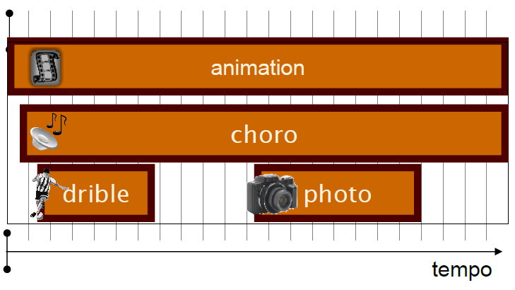
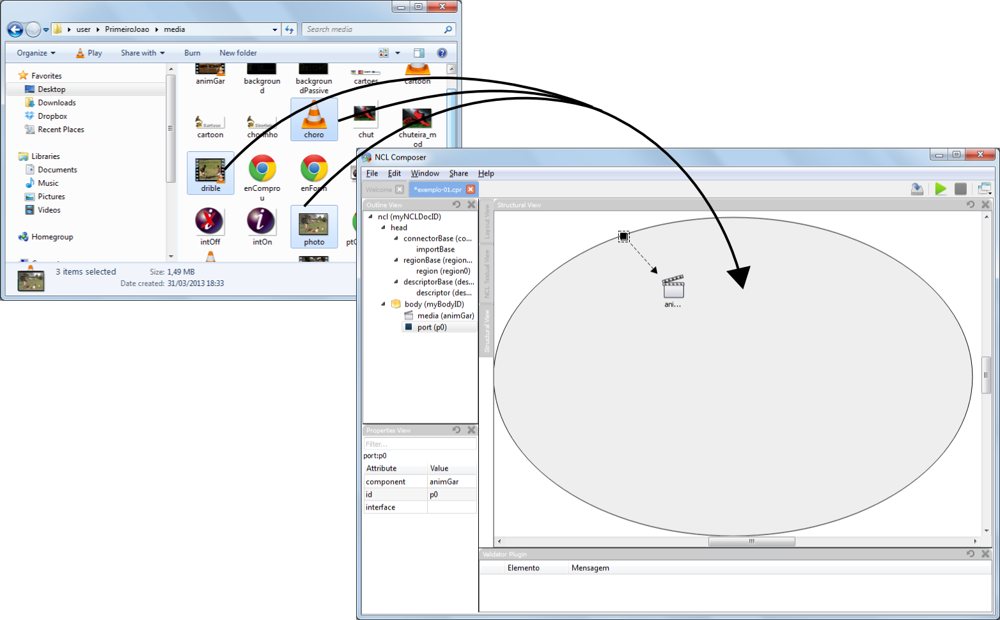
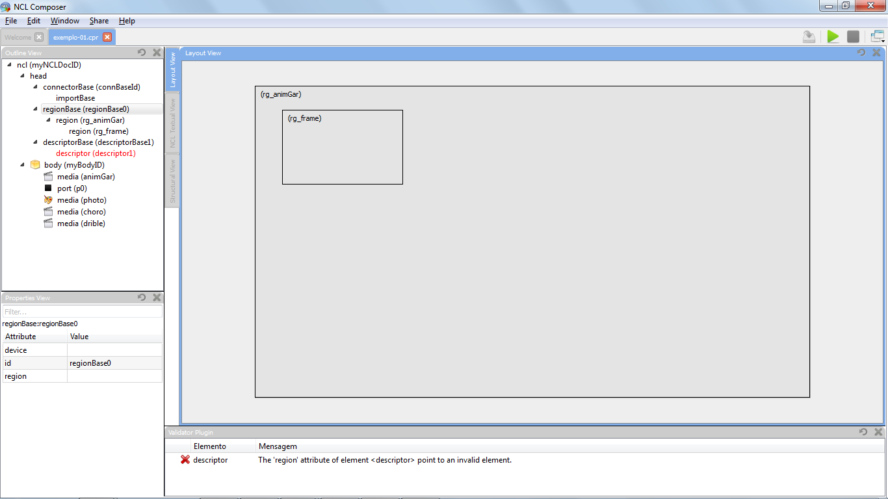
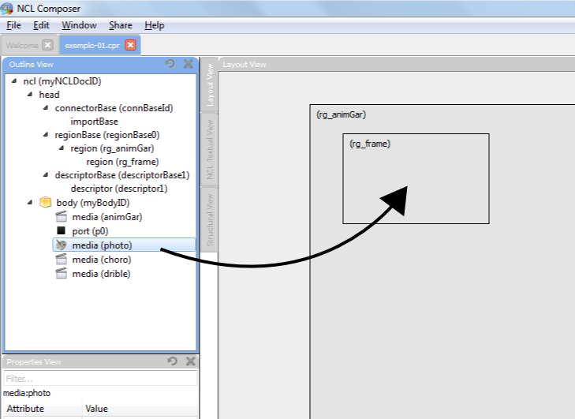

## Exemplo 2: Sincronismo sem Interatividade ##

### Objetivo ###
O próximo exemplo ilustra como é possível introduzir vários objetos de
mídia sincronizados no tempo. Para isso, vamos começar a partir do projeto que
desenvolvemos no <<sample:00, exemplo anterior>> e vamos acrescentar:

  1. **uma música de fundo** (um chorinho), que deverá começar assim que terminar a
apresentação inicial do vídeo e começar a animação propriamente dita;
  2. **um objeto de vídeo**, que deverá ser exibido em paralelo e sincronizado
com o famoso “drible do vaivém” do Mané, retratado na animação; e ainda
  3. **uma imagem**, uma foto, que deverá ser exibida junto com a cena do
marcador caído no chão.

A imagem a seguir apresenta a visão temporal deste exemplo:

### Passo 1: Salvar como...###
Para reusarmos o que já foi feito no exemplo anterior, vamos abrí-lo e criar um
novo projeto baseado nele, por meio do menu _File->Save as..._.  

### Passo 2: Adicionando os objetos de mídia  (**O que?**) ###
Da mesma forma que no <<example:01, exemplo anterior>> vamos arrastar os objetos
de mídia que ainda não estão na nossa aplicação para dentro da
{structural_view}, conforme a figura a seguir:

### Passo 3: Onde os objetos de mídia serão apresentados (**Onde?**) ###

Dado que já definimos _quais_ são os objetos de mídia que fazem parte da nossa
aplicação, vamos agora definir _onde_ cada um desses objetos será apresentado.

Para isso, vamos na visão de leiaute criar as regiões a seguir:

Para associar o objeto de mídia a região criada basta selecionar e arrastar o
objeto de mídia da {outline_view} para a região que deseja associá-lo:

### Passo 4: Quando os objetos de mídia serão apresentados: _Links_ (**Quando?**)###
TODO

### Passo 5: Executando o exemplo ###
TODO

