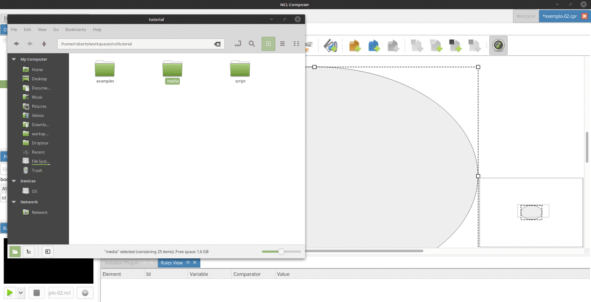
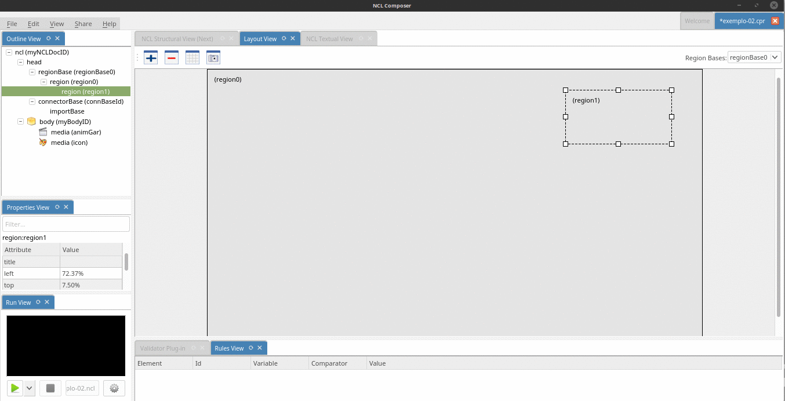
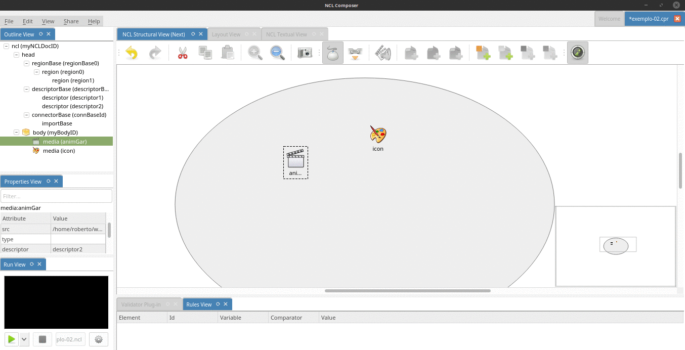
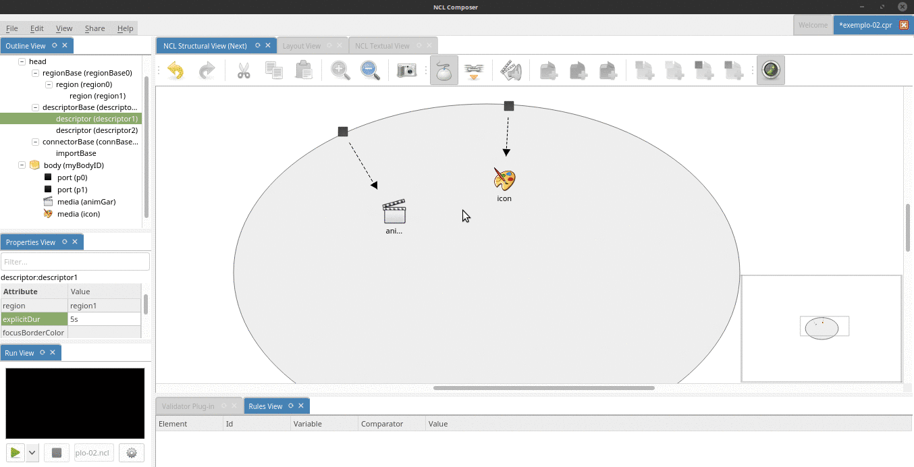

# Exemplo 02: Reproduzindo um vídeo e uma imagem

## Objetivo
O objetivo deste exemplo é apresentar um vídeo e uma imagem na tela.

Para isso, iremos:

  * Adicionar os dois objetos de mídia (vídeo e imagem) na nossa aplicação;
  * Criar duas regiões (uma para cada objeto) e associá-las aos objetos de
    mídia; e
  * Informar que os dois objetos devem ser apresentados quando a aplicação
    começar.

## Passo 1: Adicionando os objetos de mídia  (**O que?**)
Neste exemplo, queremos uma aplicação com dois objetos de mídia (um vídeo e uma
imagem).  Para inserí-los no seu projeto, basta arrastar as duas mídias do seu
gerenciador de arquivos para a {structural_view} do {nclcomposer}.

> Caso precise de mais informações sobre como criar um novo projeto veja o
> [__Passo 0__ do Exemplo 01](01.hello_world).

## Passo 2: Onde os objetos de mídia serão apresentados
Agora iremos definir __onde__ os objetos de mídia serão apresentados.
Para isso iremos criar regiões na tela, por meio da {layout_view} e associar os
objetos de mídia à essas regiões. 

### Criando as regiões

Como podemos perceber ao acessar a {layout_view}, por padrão, o {nclcomposer}
já cria uma região `region0` que ocupa toda a tela. Iremos reusar essa região
para o vídeo (queremos que ele ocupe toda a tela) e iremos criar uma nova
região para a imagem.  Para isso, podemos clicar com o botão direito do mouse
na região existente e acessar a opção `Add region` do menu contextual. Uma nova
região será criada, e podemos agora redimensioná-la e posicioná-la da forma que
nos convier.

### Associando os objetos de mídia às regiões

Depois de criarmos as regiões, agora queremos associar cada um dos objetos de
mídia (o vídeo e a imagem) a cada uma das suas regiões.  Para isso, basta
arrastar o objeto de mídia a partir da {outline_view} para a sua respectiva
região na {layout_view}.

## Passo 3: Quando os objetos de mídia serão apresentados

Como os dois objetos de mídia iniciarão no começo da aplicação, uma forma
simples de definir esse comportamento é criando-se uma porta para cada um
desses objetos.

Diferente de objetos de mídia de vídeo e áudio, objetos de mídia
estáticos---como, por exemplo, imagens---não possuem duração implícíta.  Neste
caso, caso iniciemos sua execução ela sendo apresentada indefinidamente.  Para
definirmos a duração de uma mídia (por exemplo, uma imagem) de forma explícita
podemos o atributo ``explicitDur`` no descritor associado à esta mídia (veja a
animação abaixo, onde definimos que a imagem irá durar ``5s``).

## Passo 4: Executando o exemplo
Feito isso, o nosso exemplo já está completo e podemos executá-lo na
{run_view}.

