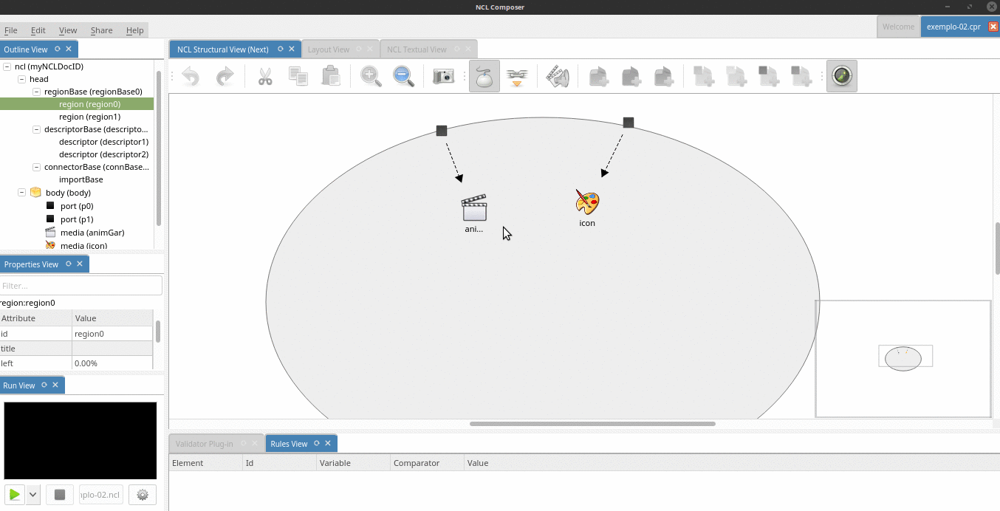

# Exemplo 03: Iniciando e terminando dois objetos de mídia simultaneamente

## Objetivo
O objetivo deste exemplo é iniciar e terminar dois objetos de mídia
simultaneamente.

Para isso, iremos:

  * Adicionar os dois objetos de mídia que fazem parte da aplicação (um vídeo e
    uma imagem);
  * Criar duas regiões, uma para o vídeo e uma para a imagem, e associar os
    respectivos objetos de mídia à suas regiões;
  * Informar que o vídeo começará a ser apresentado no início da aplicação; e
  * Criar dois elos:
    * Um informando que a imagem iniciará sua apresentação quando o vídeo
      começar a ser executado; e
    * Outro informando que a imagem irá terminar a sua execução quando o vídeo
      terminar a sua execução.

## Passo 1: Adicionando os objetos de mídia  (**O que?**)
Da mesma forma que no exemplo anterior iremos arrastar os dois objetos de mídia
que ainda fazem parte da nossa aplicação (um vídeo e uma image) para a
{structural_view}.

## Passo 2: Onde os objetos de mídia serão apresentados (**Onde?**)

Agora iremos definir __onde__ os objetos de mídia serão apresentados.
Para isso, iremos criar regiões na tela por meio da {layout_view} e associar os
objetos de mídia à essas regiões. 

### Criando as regiões

Como podemos perceber ao acessar a {layout_view}, por padrão, o {nclcomposer}
já cria uma região `region0` que ocupa toda a tela. Iremos reusar essa região
para o vídeo (queremos que ele ocupe toda a tela) e iremos criar uma nova
região para a imagem.  Para isso, podemos clicar com o botão direito do mouse
na região existente e acessar a opção `Add region` do menu contextual. Uma nova
região será criada, e podemos agora redimensioná-la e posicioná-la da forma que
nos convier.

### Associando os objetos de mídia às regiões

Depois de criarmos as regiões, agora queremos associar cada um dos objetos de
mídia (o vídeo e a imagem) a cada uma das suas regiões.  Para isso, basta
arrastar o objeto de mídia a partir da {outline_view} para a sua respectiva
região na {layout_view}.

## Passo 4: Quando os objetos de mídia serão apresentados: _Links_ (**Quando?**)

Para informar __quando__ os objetos de mídia serão executados iremos:

  * Criar uma __porta__ para o vídeo, informando que ele deve ser apresentado
    quando a aplicação iniciar sua execução; e 
  * Criar dois elos sincronizando a imagem com o video acima.  O primeiro elo
    irá informar que __a apresentação da imagem deve começar quando a
    apresentação do vídeo começar__, e o segundo elo irá informar que a
    __apresentação da imagem deve terminar quando a apresentação do vídeo terminar__.

### Informando o objeto que será inicialmente apresentado

Para criarmos uma porta para o vídeo principal podemos, na {structural_view},
selecionar o `body` e pressionar o botão `Insert port` na barra de ferramentas.
Feito isso, teremos uma nova porta no `body`.

Para associarmos essa porta ao vídeo de nossa aplicação podemos selecionar a
`ferramenta de link` na barra de ferramentas e clicar com o botão esquerdo do
mouse e (ainda segurando o botão) arrastar o ponteiro para o vídeo. 

Com isso, já definimos que __quando a aplicação iniciar__ o __vídeo iniciará a
sua apresentação__.

### Sincronizando o início e o fim do vídeo com o início e fim da imagem

Para sincronizarmos a apresentação do vídeo com a apresentação da imagem,
iremos usar elos.  Para criarmos um elo entre dois objetos de mídia na
{structural_view} podemos:

  1. selecionar a `ferramenta de link` na barra de ferramentes; e, depois
  2. clicar com o botão direito do mouse sobre o primeiro objeto de mídia (no
     caso do nosso exemplo, o vídeo), mantendo o botão do mouse pressionado,
     arrastar o ponteiro até o segundo objeto (no nosso exemplo, a imagem).

Com isso, iremos criar um elo no qual o primeiro objeto clicado participará
como parte da condição, e a ação será executada sobre o segundo objeto (para o
qual arrastamos o elo).

Logo após criarmos um elo com o procedimento acima, uma nova janela irá abrir,
na qual poderemos detalhar as informações desse elo.  Em especial, devemos
escolher qual o __tipo de elo__ que estamos criando (ou seja, qual o
__conector__ daquele elo) e quais as __ações__ e __condições__ dos objetos que
selecionamos.  Geralmente, só modificamos as ações ou condições quando o elo
que estamos criando possuir mais de uma condição ou mais de uma ação.

> Alguns tipos de elo também podem receber parâmetros (e.g. um parâmetro
> _delay_ que informa com quanto tempo depois de a condição satisfeita as ação
> deve ser executada).  E também podemos definir os valores desses parâmetros na
> janela de criação de elos.

No caso do nosso exemplo, iremos escolher o tipo do primeiro elo
``onBeginStart`` (ou __ao começar__ "isto", __inicie__ "aquilo"), informando
que quando o primeiro objeto selecionado (o vídeo) começar a sua apresentação,
queremos que o segundo objeto (a imagem) também comece a sua apresentação.

Para o segundo elo, iremos escolher o tipo ``onEndStop`` (ou __ao terminar__
"isto", __termine__ aquilo).  Dessa forma, iremos informar que o final do vídeo
deve também disparar a finalização da imagem.

## Passo 5: Executando o exemplo

Pronto!  O nosso Exemplo 03 está pronto.  Para testá-lo basta executá-lo na
{run_view}.  O resultado deve ser o início do vídeo e da imagem no início da
aplicação e os dois devem continuar apresentando até o final do vídeo, quando
os dois devem ser finalizados, e a aplicação termina a sua execução.

------
## Passo 0: Salvar como...
Para reusarmos o que já foi feito no exemplo anterior, vamos abrí-lo e criar um
novo projeto baseado nele, por meio do menu _File->Save as..._.  

