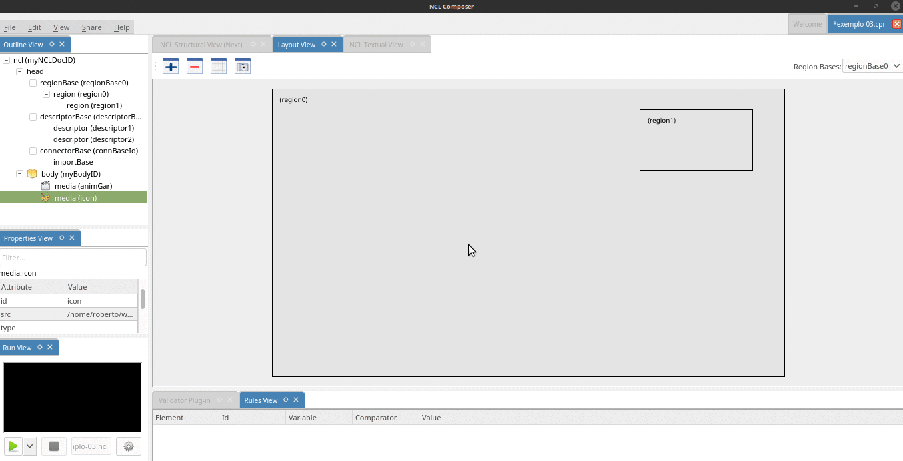
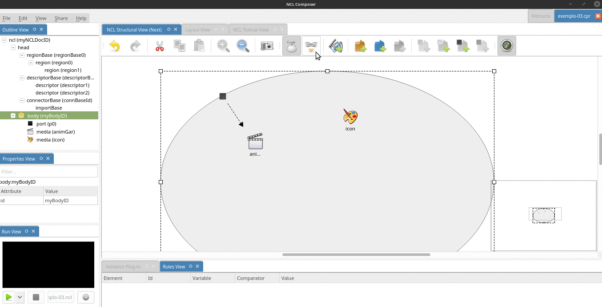

# Exemplo 2: Iniciando e terminando dois objetos de mídia simultaneamente

## Objetivo
O objetivo deste exemplo é iniciar e terminar dois objetos de mídia
simultaneamente.

Para isso, iremos:

  * Adicionar os dois objetos de mídia que fazem parte da aplicação (um vídeo e
    uma imagem);
  * Criar duas regiões, uma para o vídeo e uma para a imagem, e associar os
    respectivos objetos de mídia à suas regiões;
  * Informar que o vídeo irá ser executado no início da apresentação da
    aplicação; e
  * Criar dois elos:
    * Um informando que a imagem iniciará sua apresentação quando o vídeo
      começar a ser executado; e
    * Outro informando que a imagem irá terminar a sua execução quando o vídeo
      terminar a sua execução.

## Passo 1: Adicionando os objetos de mídia  (**O que?**)
Da mesma forma que no exemplo anterior iremos arrastar os dois objetos de mídia
que ainda fazem parte da nossa aplicação (um vídeo e uma image) para a
{structural_view}.

## Passo 2: Onde os objetos de mídia serão apresentados (**Onde?**)

Agora iremos definir __onde__ os objetos de mídia serão apresentados.
Para isso, iremos criar regiões na tela por meio da {layout_view} e associar os
objetos de mídia à essas regiões. 

### Criando as regiões

Como podemos perceber ao acessar a {layout_view}, por padrão, o {nclcomposer}
já cria uma região `region0` que ocupa toda a tela. Iremos reusar essa região
para o vídeo (queremos que ele ocupe toda a tela) e iremos criar uma nova
região para a imagem.  Para isso, podemos clicar com o botão direito do mouse
na região existente e acessar a opção `Add region` do menu contextual. Uma nova
região será criada, e podemos agora redimensioná-la e posicioná-la da forma que
nos convier.

### Associando os objetos de mídia às regiões

Depois de criarmos as regiões, agora queremos associar cada um dos objetos de
mídia (o vídeo e a imagem) a cada uma das suas regiões.  Para isso, basta
arrastar o objeto de mídia a partir da {outline_view} para a sua respectiva
região na {layout_view}.

## Passo 4: Quando os objetos de mídia serão apresentados: _Links_ (**Quando?**)

### Informando o objeto que será inicialmente apresentado

### Sincronizando o início e o fim do vídeo com o início e fim da imagem

## Passo 5: Executando o exemplo

------
## Passo 0: Salvar como...
Para reusarmos o que já foi feito no exemplo anterior, vamos abrí-lo e criar um
novo projeto baseado nele, por meio do menu _File->Save as..._.  

