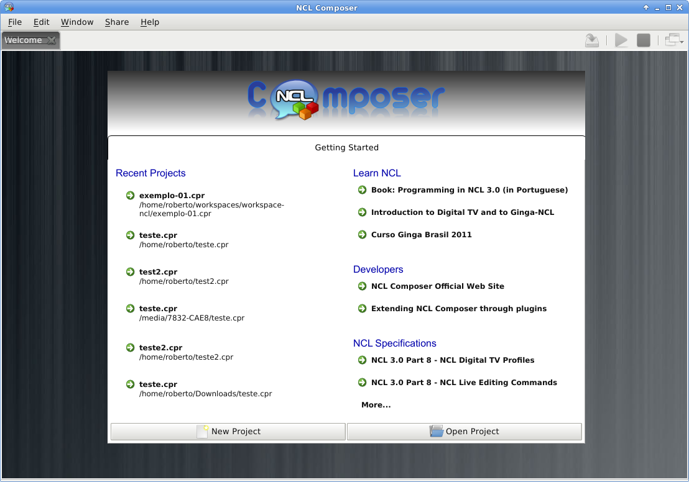
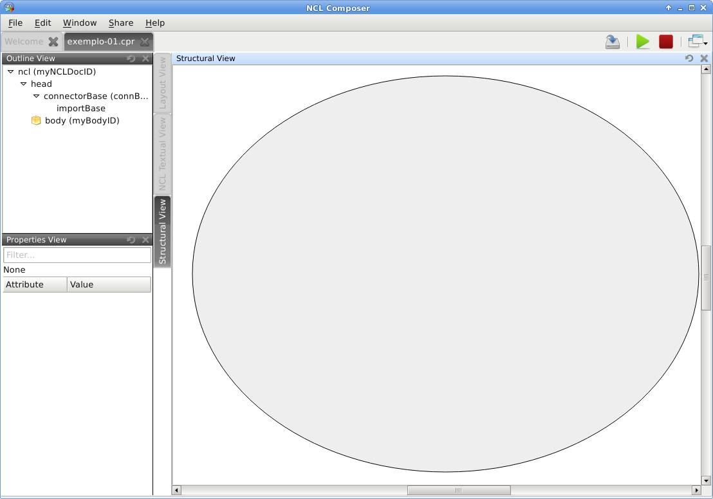
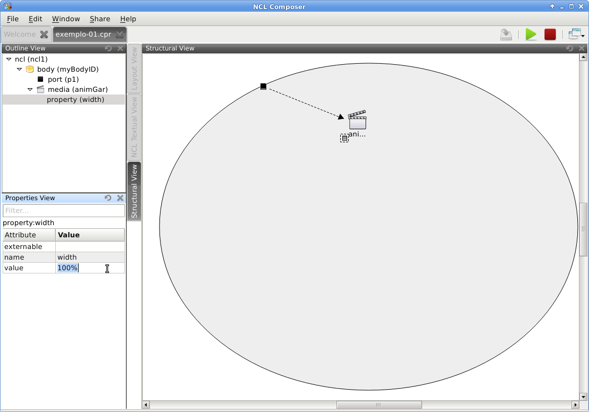
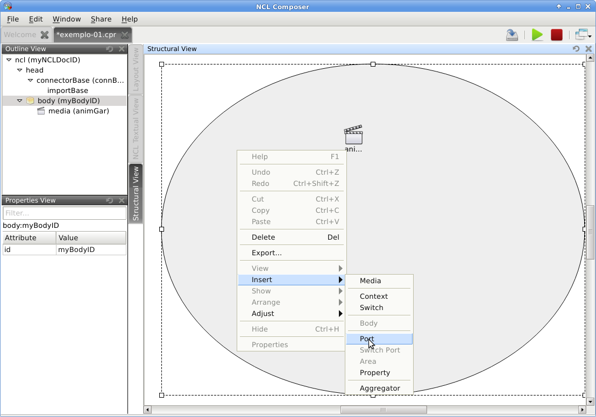
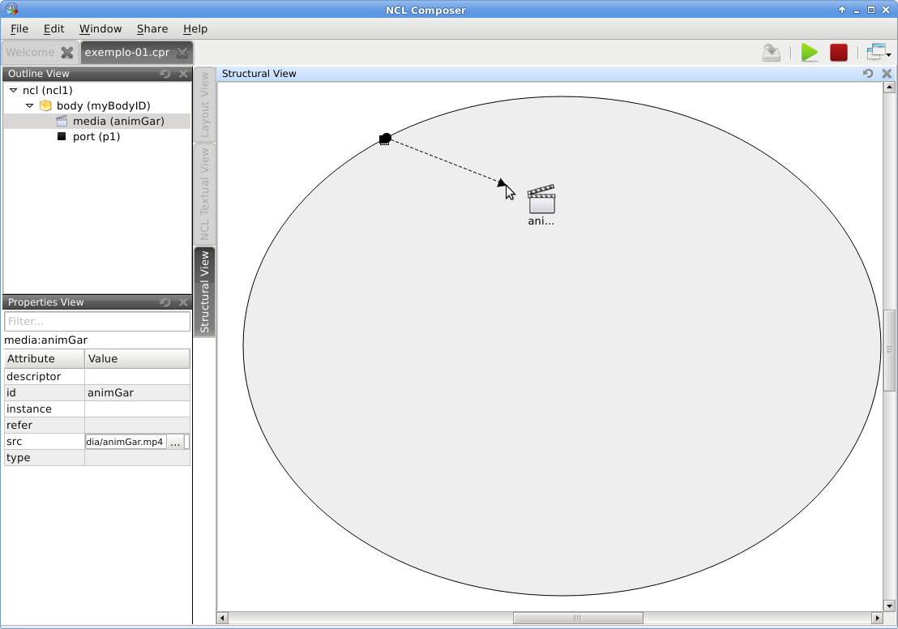

## Exemplo 1: Olá Garrincha! ##

### Objetivo ###
Neste primeiro exemplo, o objetivo é apenas exibir o vídeo da animação em tela
cheia.

### Passo 1: Criando um novo projeto ###

A primeira tarefa para isso é criar um novo projeto. 
Ao abrir o {nclcomposer}, a seguinte tela de boas-vindas é apresentada:

Para criar um novo projeto, pressione o botão _New Project_ no canto esquerdo
inferior dessa tela.

> **NOTA**: Outra possibilidade para criar um novo projeto é através do menu 
> _File->New Project_.

Feito isso, a seguinte janela será exibida:

Atribua um nome para o projeto que você está criando, selecione o diretório
onde deseja salvá-lo e deixe as opções _Copy and Import the default Connector
Base_ e _Add a default region to the project_ ativas. 

> **NOTA** Nas próximas seções serão discutidos em detalhes o que são os 
> conectores e também as bases de conectores. Por enquanto, apenas deixe esta 
> opção marcada, pois ela será útil para os próximos exemplos.

Feito isso, pressione o botão _Finish_ e a seguinte tela será apresentada:

Com o primeiro projeto criado, pode-se ter acesso às visões que já vem
instaladas por _default_ no NCL Composer: {default_views}.

Observe também que, quando criamos um novo projeto, o {nclcomposer}
automaticamente já o cria com o cabeçalho e o corpo da aplicação. Se você for
para a visão _Textual_, por exemplo,s
[source]

<code>
 <?xml version="1.0" encoding="ISO-8859-1"?>
 <ncl id="myNCLDocID" xmlns="http://www.ncl.org.br/NCL3.0/EDTVProfile">
  <head>
    <connectorBase id="connBaseId">
      <importBase alias="conn" documentURI="defaultConnBase.ncl"/>
    </connectorBase>
  </head>
  <body id="myBodyID"/>
</ncl>
</code>

<!--

//.Para saber mais: eXtensible Markup Language
//********************************************
//Alguns pontos que você deve saber sobre XML são:
//
//  * XML significa _EXtensible Markup Language_.
//	* XML é uma linguagem textual para descrição de dados.
//	* XML é uma recomendação W3C.
//
//**Tags, elements, and attributes**
//
//Existem três termos comumente utilizados para descrever partes de um documento
//XML: tags, elementos e atributos. Segue um exemplo que ilustra tais termos:
//
//--------
//<address>
//  <name>
//    <title>Mrs.</title>
//    <first-name>
//      Mary
//    </first-name>
//    <last-name>
//      McGoon
//    </last-name>
//  </name>
//  <street>
//    1401 Main Street
//  </street>
//  <city state="NC">Anytown</city>
//  <postal-code>
//    34829
//  </postal-code>
//</address>
//---------
//
//Uma **tag** é o texto entre os símbolos "<", à esquerda, e ">", à direita. Existem
//tags de início (como <name>) e tags de final (</name).
//
//Um **elemento** é composto por uma tag de início, uma tag de final e tudo entre
//essas. No exemplo acima, o elemento <name> contém três elementos-filhos: <title>,
//<first-name> e <last-name>.
//
//Um atributo é par nome-valor dentro de uma tag de início de um elemento. No
//exemplo acima, state é um atributo do elemento <city> element.
//
//	* Um documento XML é um documento textual composto por um conjunto de
//	* elementos aninhados.
//	* As tags XML não são predefinidas. Cada aplicação XML define as suas
//	  próprias tags.
//	* NCL é um exemplo de aplicação XML que define suas próprias
//		tags (<ncl>, <head>, <body>, <media>, ...).
//
//********************************************
//
//.Para saber mais: Estrutura do documento NCL
//************************************************
//Um documento NCL é um arquivo escrito em XML. Todo documento NCL possui a
//seguinte estrutura:
//
//  * uma seção de prólogo, definindo a codificação do arquivo.
//	* um cabeçalho de arquivo NCL (<ncl>).
//	* uma seção de cabeçalho, onde são definidos os elementos que serão
//	  reutilizados no corpo (<head>).
//	* o corpo do programa, (<body>), onde são definidos os diversos objetos de
//	  mídia (<media) e como eles se relacionam.
//	* pelo menos uma porta que indica onde o programa começa a ser exibido.
//	  (<port>).
//	* a conclusão do documento.
//
//TODO: Figura com o esqueleto de um documento NCL.
//************************************************
//
-->

### Passo 2: Adicionando um objeto de mídia ###

Para inserir os objetos de mídia, a forma mais simples é apenas arrastá-los do
seu Gerenciador de Arquivos para dentro da {structural_view} do {nclcomposer}.

> **DICA:** Outra forma de inserir um objeto de mídia, na {structural_view} é 
> clicar com o botão direito sobre o corpo do documento e selecionar o menu 
> _Insert -> Media_. Neste caso, é importante não esquecer de definir o caminho 
> para o objeto de mídia, o que poder ser realizado selecionando o objeto que 
> você acabou de editar e alterando o valor do atributo _src_ (ou na _Visão de
> Propriedades_ ou na _Visão Textual_).

<!--
//.Para saber mais: Objetos de Mídia
//************************************************
//TODO
//************************************************
//
-->

### Passo 3: Definindo propriedades do objeto de mídia ###

Para finalizar este primeiro exemplo só falta agora definirmos onde o vídeo da
animação será exibido. A forma mais simples de definir as dimensões do objeto de
mídia, é por meio de propriedades.

Para inserirmos propriedades nos objetos de mídia por meio da _Visão Estrutural_
a forma mais direta é clicando com o botão direto do mouse sobre o objeto de
mídia no qual queremos inserir uma nova propriedade e selecionando o menu 
_Insert->Property_.

Neste nosso primeiro exemplo estamos especialmente interessados nas
propriedades que definem a dimensão dos objetos: _top_, _left_, _width_ e
_height_.

Para editar a propriedade inserirmos anteriormente é suficiente a
selecionarmos pela {structural_view} e, depois, a partir da visão de
propriedades podemos definir o seu nome e seu valor. No caso do nosso 
exemplo, devemos definir a propriedade _width_ e o valor 100%:

Da mesma forma, deve-se  criar uma propriedade _height_, também com o valor 
de 100%. Definindo assim, que nossa mídia irá ocupar toda a tela quando 
for apresentada.

### Passo 4: Informando o(s) objeto(s) de mídia que serão inicialmente exibidos ####

Para informar que o objeto de mídia que acabamos de inserir deve iniciar
quanto a nossa aplicação multimídia iniciar, é suficiente criarmos uma porta
no corpo do documento, mapeando-a para o objeto de mídia.

Para inserirmos uma porta no corpo do documento pela _Visão
Estrutural_ é suficiente clicarmos com o botão direito sobre o corpo e
selecionarmos o menu _Insert->Port_.

**FIXME**: Esta figura deveria ter as duas propriedades definidas no passo
anterior.

Para mapearmos a porta que acabamos de criar para o objeto de mídia, devemos, 
segurando a tecla _SHIFT_, clicar sobre a porta e arrastar o ponteiro
do mouse para o objeto de mídia.  

**FIXME**: Esta figura deveria ter as duas propriedades definidas no passo
anterior.

Com isso, já definimos que nossa aplicação é constituída apenas do objeto de
mídia _animGar_ e que quando a aplicação começar, o primeiro objeto de mídia a
ser apresentado será o vídeo da animação _O Primeiro João_. 

### Passo 5: Executando o exemplo ###
Dado que o NCL Composer está devidamente <<sec:player_integration, configurado
para executar algum player NCL>> de sua escolha, basta executar a aplicação
por meio do botão "Run NCL Project"  na barra de
ferramentas.

A seguinte tela exemplifica o exemplo em execução:

<!--
//.Para saber mais: Propriedades dos Objetos de Mídia
//***************************************************
//TODO
//***************************************************
-->
